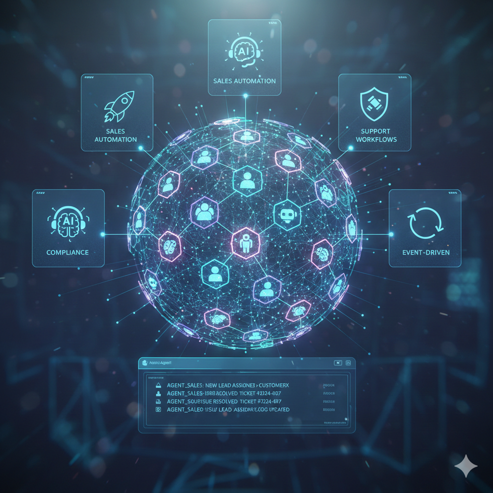

<div align="center">

# 🚀 Multi-Agent Enterprise CRM

### **AI-Native • Event-Driven • Multi-Tenant • Enterprise-Grade**

[](https://choosealicense.com/licenses/mit/)
[](https://www.docker.com/)
[](https://kubernetes.io/)
[](https://www.typescriptlang.org/)
[](https://www.python.org/)
[](https://nextjs.org/)

<br/>

> ⚠️ **Under Active Development** — This project is being actively built with enterprise-grade features. Contributions welcome!

<br/>



**A production-grade, AI-native CRM where intelligent agents work alongside humans to automate sales, support, and compliance workflows with complete auditability and governance.**

[Features](#-key-features) •
[Architecture](#%EF%B8%8F-architecture) •
[Quick Start](#-quick-start) •
[AI Agents](#-ai-agents) •
[Enterprise Capabilities](#-enterprise-capabilities) •
[Documentation](#-documentation)

</div>

---

## ✨ Key Features

<table>
<tr>
<td width="50%">

### 🤖 AI-Native Design

- **Autonomous Agents** — Sales, Support, Compliance & Analytics agents as first-class system actors
- **LangGraph Orchestration** — Sophisticated multi-step agent workflows
- **Ollama Integration** — Privacy-first local LLM powered by Llama 3.1
- **Vector Search** — Semantic search with Weaviate for intelligent retrieval

</td>
<td width="50%">

### 🔄 Event-Driven Architecture

- **Apache Kafka** — Real-time event streaming backbone (KRaft mode)
- **CQRS + Event Sourcing** — Separate read/write paths with full history
- **Transactional Outbox** — Reliable exactly-once event publishing
- **Time-Travel Debugging** — Replay events and rebuild state at any point

</td>
</tr>
<tr>
<td width="50%">

### 🔐 Enterprise Security

- **Multi-Tenant Isolation** — Row-Level Security (RLS) at database level
- **Zero Trust Architecture** — OPA-based RBAC + ABAC policies
- **Kill Switch & Governance** — Emergency agent controls with full audit trail
- **GDPR Compliance** — Data erasure, export, and retention policies

</td>
<td width="50%">

### 👥 Human-in-the-Loop

- **Approval Workflows** — Human oversight for high-risk AI actions
- **Explainable AI** — Every agent decision is recorded and explainable
- **Reversible Actions** — Full audit trail with rollback capabilities
- **Governance Dashboard** — Real-time monitoring of AI behavior

</td>
</tr>
</table>

---

## 🏗️ Architecture

```
┌─────────────────────────────────────────────────────────────────────────────┐
│                          🌐 PRESENTATION LAYER                               │
│  ┌─────────────────────────────────────────────────────────────────────┐    │
│  │                    Next.js 14 + Tailwind CSS                         │    │
│  │     Real-time Dashboard • Event Timeline • Governance Console        │    │
│  └─────────────────────────────────────────────────────────────────────┘    │
└───────────────────────────────────┬─────────────────────────────────────────┘
                                    │
                                    ▼
┌─────────────────────────────────────────────────────────────────────────────┐
│                          🚪 API GATEWAY LAYER                                │
│  ┌─────────────────────────────────────────────────────────────────────┐    │
│  │              Node.js + Express + TypeScript + OpenTelemetry          │    │
│  │    Auth • Rate Limiting • Secure Cache • Tenant Context • Routing    │    │
│  └─────────────────────────────────────────────────────────────────────┘    │
└───────────────────────────────────┬─────────────────────────────────────────┘
                                    │
                    ┌───────────────┼───────────────┐
                    ▼               ▼               ▼
┌───────────────────────────────────────────────────────────────────────────────┐
│                      🧠 AI AGENT LAYER (LangGraph + Ollama)                   │
│  ┌──────────────┐ ┌──────────────┐ ┌──────────────┐ ┌──────────────┐         │
│  │    Sales     │ │   Support    │ │  Compliance  │ │  Analytics   │         │
│  │    Agent     │ │    Agent     │ │    Agent     │ │    Agent     │         │
│  └──────────────┘ └──────────────┘ └──────────────┘ └──────────────┘         │
│  ┌──────────────────────────────────────────────────────────────────┐        │
│  │  Kill Switch • Explainability Engine • Agent Telemetry • OPA     │        │
│  └──────────────────────────────────────────────────────────────────┘        │
└───────────────────────────────────┬───────────────────────────────────────────┘
                                    │
                                    ▼
┌───────────────────────────────────────────────────────────────────────────────┐
│                       📡 EVENT STREAMING LAYER                                 │
│  ┌─────────────────────────────────────────────────────────────────────┐     │
│  │             Apache Kafka • Transactional Outbox • Schema Registry    │     │
│  │        Circuit Breaker • Idempotent Consumers • Event Contracts      │     │
│  └─────────────────────────────────────────────────────────────────────┘     │
└───────────────────────────────────────────────────────────────────────────────┘
                                    │
                                    ▼
┌───────────────────────────────────────────────────────────────────────────────┐
│                        💾 DATA & INFRASTRUCTURE                                │
│  ┌─────────────┐ ┌─────────────┐ ┌─────────────┐ ┌─────────────────────┐     │
│  │ PostgreSQL  │ │    Redis    │ │  Weaviate   │ │        OPA          │     │
│  │  16 + RLS   │ │ Secure Cache│ │  (Vectors)  │ │  (Policy Engine)    │     │
│  └─────────────┘ └─────────────┘ └─────────────┘ └─────────────────────┘     │
│  ┌─────────────────────────────────────────────────────────────────────┐     │
│  │         Prometheus • Grafana • OpenTelemetry • Loki                  │     │
│  └─────────────────────────────────────────────────────────────────────┘     │
└───────────────────────────────────────────────────────────────────────────────┘
```

---

## 🚀 Quick Start

### Prerequisites

| Requirement | Version |
|-------------|---------|
| Docker & Docker Compose | Latest |
| Node.js | 20+ |
| Python | 3.11+ |
| Git | Latest |

### 🐳 One-Command Setup

```bash
# Clone the repository
git clone https://github.com/Mrgig7/Multi-Agent-Enterprise-CRM.git
cd Multi-Agent-Enterprise-CRM

# Copy environment configuration
cp .env.example .env

# Launch the entire stack
docker-compose up -d

# Run database migrations
docker-compose exec gateway npx prisma migrate deploy

# Apply RLS policies
docker-compose exec postgres psql -U crm_user -d enterprise_crm -f /docker-entrypoint-initdb.d/02-rls-policies.sql
```

### 🌐 Access Points

| Service | URL | Credentials |
|---------|-----|-------------|
| **Frontend** | http://localhost:3000 | — |
| **API Gateway** | http://localhost:4000 | — |
| **Kafka UI** | http://localhost:8080 | — |
| **Grafana** | http://localhost:3001 | admin / admin |
| **Keycloak** | http://localhost:8081 | admin / admin |
| **Weaviate** | http://localhost:8082 | — |
| **OPA** | http://localhost:8181 | — |

---

## 🤖 AI Agents

Our AI agents are built with **LangGraph** for orchestration and **Ollama** running **Llama 3.1** locally for privacy-first inference.

</td>
</tr>
<tr>
<td align="center" width="25%">

### 📚 Knowledge Agent

**Self-Growing Documentation**

- Auto-generates KB drafts from resolved tickets
- Summarizes support conversations
- Human approval workflow
- Weaviate-embedded semantic search

</td>
<td align="center" width="25%">

### 💼 Sales Agent

**Lead Qualification & Scoring**

- Analyzes lead behavior patterns
- Predicts conversion probability
- Suggests next-best-action
- Automates follow-up sequences

</td>
<td align="center" width="25%">

### 🎧 Support Agent

**Intelligent Ticket Triage**

- Auto-categorizes incoming tickets
- Suggests knowledge base articles
- Routes to specialist teams
- Tracks SLA compliance

</td>
<td align="center" width="25%">

### ⚖️ Compliance Agent

**Policy Enforcement**

- Validates data handling policies
- Performs risk assessments
- Generates audit trails
- Monitors regulatory compliance

</td>
</tr>
<tr>
<td align="center" width="25%">

### 📊 Analytics Agent

**Business Intelligence**

- Identifies trends and patterns
- Detects anomalies in data
- Generates predictive insights
- Creates automated reports

</td>
</tr>
</table>

---

## 🏢 Enterprise Capabilities

### 🔒 Multi-Tenant Security
- **Row-Level Security** — Complete tenant isolation at database level
- **100% Cross-Tenant Access Blocked** — Verified in CI with penetration tests
- **OPA Policy Engine** — Declarative RBAC + ABAC policies
- **Keycloak Integration** — Enterprise SSO with OAuth2/OIDC

### 🕐 Event Sourcing & Replay
- **Complete Event History** — Every state change captured
- **Time-Travel UI** — Interactive timeline with state diff viewer
- **Aggregate Rebuild** — Reconstruct any entity at any point in time
- **Snapshot Optimization** — Fast checkpoint recovery

### 🛡️ AI Governance
- **Kill Switch** — Emergency stop for any agent (global, tenant, or individual)
- **Approval Workflows** — Human oversight for high-risk actions
- **Explainability Engine** — Full decision audit with reasoning chain
- **Agent Telemetry** — Prometheus metrics for latency, errors, policy violations

### 🧾 GDPR & Compliance
- **Forget Customer** — Complete data erasure with audit trail
- **Data Export** — Full DSAR-compliant data portability
- **Retention Policies** — Configurable per-tenant, per-entity
- **PII Classification** — Automatic sensitive data handling

### 💥 Chaos Engineering
- **Kafka Failure Recovery** — Graceful degradation and auto-recovery
- **Circuit Breakers** — Per-dependency with automatic recovery
- **Idempotent Consumers** — Exactly-once processing semantics
- **Chaos Test Suite** — Automated reliability verification

### 🌍 Disaster Recovery
- **Documented RPO/RTO** — 5 min RPO, 30 min RTO targets
- **Backup & Restore** — Full database and event store backup
- **Read Model Rebuild** — Deterministic state reconstruction
- **Integrity Validation** — Automated checksum verification

---

## 🛠️ Technology Stack

### Application Layer

| Component | Technology | Purpose |
|-----------|------------|---------|
| Frontend | **Next.js 14** + Tailwind CSS | Modern React with SSR/SSG |
| API Gateway | **Node.js** + Express + TypeScript | Routing, auth, rate limiting |
| AI Engine | **LangGraph** + Ollama (Llama 3.1) | Agent orchestration + local LLM |
| Core Services | **Python 3.11** + asyncpg | Event processing, governance |

### Data Layer

| Component | Technology | Purpose |
|-----------|------------|---------|
| Primary DB | **PostgreSQL 16** + RLS | Transactional data + tenant isolation |
| Cache | **Redis 7** | Secure caching + rate limiting |
| Vector Store | **Weaviate** | Semantic search, embeddings |
| ORM | **Prisma** | Type-safe database access |

### Infrastructure

| Component | Technology | Purpose |
|-----------|------------|---------|
| Messaging | **Apache Kafka** (KRaft) | Event streaming, no Zookeeper |
| Auth | **Keycloak** | SSO, OAuth2, OIDC |
| Policy Engine | **Open Policy Agent** | RBAC + ABAC policies |
| Container | **Docker** + Kubernetes | Deployment & orchestration |

### Observability

| Component | Technology | Purpose |
|-----------|------------|---------|
| Metrics | **Prometheus** | Time-series metrics |
| Dashboards | **Grafana** | Visualization & alerts |
| Logging | **Loki** | Log aggregation |
| Tracing | **OpenTelemetry** | Distributed tracing |

---

## 📁 Project Structure

```
multi-agent-enterprise-crm/
│
├── 📱 frontend/                 # Next.js 14 Application
│   └── src/
│       ├── app/                # App Router pages
│       └── components/         # Event Timeline, Governance UI
│
├── 🚪 gateway/                  # API Gateway (Node.js + TypeScript)
│   └── src/
│       ├── middleware/         # Auth, RLS context, rate limiting
│       ├── routes/             # REST API endpoints
│       └── services/           # Kafka, Redis, Secure Cache
│
├── 🤖 agents/                   # AI Agent Layer (Python)
│   └── src/
│       ├── governance/         # Kill switch, explainability, telemetry
│       ├── replay/             # Event replay, snapshots, projectors
│       └── resilience/         # Circuit breaker, retry policies
│
├── ⚙️ core_services/            # Shared Services (Python)
│   └── src/
│       ├── cache/              # Secure tenant-aware caching
│       ├── dr/                 # Backup, restore, disaster recovery
│       ├── governance/         # GDPR erasure, export, retention
│       └── write/              # Event store, transactional outbox
│
├── 📋 policies/                 # OPA Policies (Rego)
│
├── 🗄️ database/                 # Migrations
│   └── migrations/             # RLS, event store, outbox, governance
│
├── 📊 observability/            # Monitoring
│   ├── grafana/                # Dashboards (governance, chaos, DR)
│   └── prometheus.yml
│
├── 🧪 tests/                    # Integration & Chaos Tests
│
├── 📄 docs/                     # Documentation
│
└── 🐳 docker-compose.yml        # Full development stack
```

---

## 🧪 Development

### Local Development

```bash
# Start infrastructure
docker-compose up -d postgres redis kafka opa

# Frontend (terminal 1)
cd frontend && npm install && npm run dev

# Gateway (terminal 2)
cd gateway && npm install && npm run dev

# Agents (terminal 3)
cd agents && pip install -r requirements.txt && python -m src.orchestrator.main
```

### Running Tests

```bash
# Tenant isolation tests
pytest agents/tests/test_tenant_isolation.py -v

# GDPR compliance tests
pytest tests/test_gdpr_forget.py tests/test_data_export.py -v

# Chaos tests (local environment only)
export CHAOS_TESTS_ENABLED=true CHAOS_ENVIRONMENT=local
pytest agents/tests/chaos -v

# Gateway tests
cd gateway && npm test
```

---

## 📚 Documentation

| Document | Description |
|----------|-------------|
| [SETUP_GUIDE.md](./SETUP_GUIDE.md) | Detailed installation instructions |
| [docs/ai-governance.md](./docs/ai-governance.md) | AI governance and kill switch |
| [docs/event-replay.md](./docs/event-replay.md) | Event sourcing and time-travel |
| [docs/data-governance.md](./docs/data-governance.md) | GDPR compliance |
| [docs/chaos-engineering.md](./docs/chaos-engineering.md) | Reliability testing |
| [docs/disaster-recovery.md](./docs/disaster-recovery.md) | DR procedures and RPO/RTO |

---

## 🤝 Contributing

We welcome contributions! This project is under active development.

1. **Fork** the repository
2. **Create** your feature branch (`git checkout -b feature/AmazingFeature`)
3. **Commit** your changes (`git commit -m 'Add AmazingFeature'`)
4. **Push** to the branch (`git push origin feature/AmazingFeature`)
5. **Open** a Pull Request

---

## 📄 License

This project is licensed under the **MIT License** — see the [LICENSE](LICENSE) file for details.

---

<div align="center">

### ⭐ Star this repo if you find it helpful!

**Built with ❤️ for the Enterprise AI Community**

[Report Bug](https://github.com/Mrgig7/Multi-Agent-Enterprise-CRM/issues) •
[Request Feature](https://github.com/Mrgig7/Multi-Agent-Enterprise-CRM/issues) •
[Discussions](https://github.com/Mrgig7/Multi-Agent-Enterprise-CRM/discussions)

</div>
