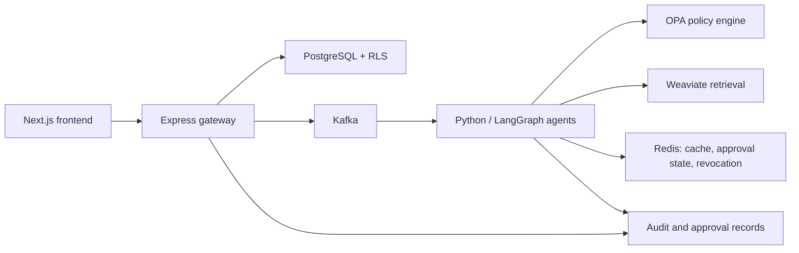

# Multi-Agent Enterprise CRM

An AI-native CRM portfolio project that demonstrates how an application can
combine agent workflows with tenant isolation, human approval, event-driven
processing, and measurable operational safeguards.

> Current deployment target: local Docker Desktop. The project is
> production-minded engineering work, not a claim of a completed cloud
> production deployment.

## Why this project exists

The business problem is not simply "add a chat box to a CRM." Sales and support
teams need recommendations that are grounded in tenant-owned data, actions that
remain reviewable by humans, and an audit trail that explains what the system
did without exposing private reasoning or other customers' data.

This repository demonstrates that boundary:

- **AI workflows:** LangGraph-based agents for support, knowledge, sales,
  analytics, automation, compliance, and search.
- **Grounded interactions:** Weaviate-backed retrieval and structured output
  validation before a model result can affect downstream work.
- **Human control:** OPA policy decisions, approval queues, kill switches, and
  audit records for higher-risk actions.
- **Tenant safety:** PostgreSQL row-level security (RLS), tenant context, and
  cross-tenant regression tests.
- **Reliable operations:** Kafka events, transactional outbox patterns,
  idempotent consumers, replay utilities, health checks, CI, SBOM, and Trivy
  image scanning.

## Start here

| If you want to... | Start with |
|---|---|
| Understand the architecture | [Architecture overview](docs/interview/architecture.md) |
| Run the application locally | [Quick start](#quick-start) |
| See the intended interview demo | [Demo script](docs/interview/demo-script.md) |
| Review design decisions | [Engineering trade-offs](docs/interview/engineering-tradeoffs.md) |
| Review current retrieval metrics | [AI evaluation baseline](evals/README.md) |
| Configure remote AI inference | [NVIDIA NIM setup](docs/interview/nvidia-nim.md) |
| See stated limitations | [Limitations](docs/interview/limitations.md) |
| Prepare technical discussion | [Interview Q&A](docs/interview/interview-qa.md) |
| Follow the optimisation work | [Interview readiness plan](docs/interview-readiness-execution-plan.md) |

## Architecture at a glance



The frontend communicates with the gateway only. The gateway owns public API
validation, authentication, and tenant context. Agent workflows consume events,
call tenant-scoped tools, consult policy, and create auditable outcomes. RLS is
the final enforcement layer for tenant-scoped database access.

## Quick start

### Prerequisites

- Docker Desktop running
- Git
- Optional for source-level development: Node.js 24+ and Python 3.11+

The default stack does **not** download or start Ollama. Local LLM inference is
an explicit opt-in, described in [Local LLM mode](#local-llm-mode).

### 1. Configure local secrets

```powershell
Copy-Item .env.example .env
```

For a local environment, set at least the following values in `.env` before
starting the stack. Use unique, non-default values if the machine is shared.

```dotenv
CRM_APP_PASSWORD=<local-password>
JWT_SECRET=<long-random-local-secret>
KEYCLOAK_ADMIN_PASSWORD=<local-password>
GRAFANA_ADMIN_PASSWORD=<local-password>
```

Keep `POSTGRES_PASSWORD`, `CRM_APP_PASSWORD`, and any standalone local
`DATABASE_URL` consistent. Do not commit `.env`.

### 2. Start and verify the stack

```powershell
docker compose up -d --build --wait
docker compose --profile migrate run --rm migrate
docker compose --profile smoke-test run --rm smoke-test
docker compose --profile ws-proxy-test run --rm ws-proxy-test
docker compose ps
```

The expected result is that the stateful services and application services are
healthy, and both smoke tests finish successfully. Re-running the migrate
command must also succeed: it is intentionally idempotent.

### 3. Open local services

| Service | URL |
|---|---|
| Frontend | http://localhost:3000 |
| Gateway health | http://localhost:4000/health |
| Kafka UI | http://localhost:8080 |
| Keycloak | http://localhost:8081 |
| Weaviate | http://localhost:8082 |
| OPA | http://localhost:8181 |
| Prometheus | http://localhost:9090 |
| Grafana | http://localhost:3001 |

### Local LLM mode

Ollama is not needed for the default stack or CI. If local inference is
explicitly required and the host is prepared for the configured GPU/runtime
requirements, enable it separately:

```powershell
docker compose --profile local-llm up -d ollama
```

The application code currently uses Ollama integrations for several live
workflows. The interview-readiness plan introduces a deterministic provider for
the canonical demo before making local inference part of any required flow.

## What can be demonstrated today

- Tenant-isolated CRM CRUD protected by PostgreSQL RLS.
- Approval workflows and kill-switch controls for agent actions.
- Explainability artifacts, audit search, and governance UI.
- Kafka topic initialization, event consumers, dead-letter handling, and replay
  components.
- Container health dependencies, idempotent database migration, and WebSocket
  proxy smoke tests.
- Image digest deployment paths, SBOM/provenance artifacts, Trivy scanning, and
  CodeQL/Dependabot governance.

The next portfolio phases add deterministic demo fixtures, a run-level agent
evidence screen, and a versioned AI evaluation suite. They are deliberately
tracked as work in progress rather than represented as already complete.

## Engineering evidence

| Area | Evidence |
|---|---|
| Tenant isolation | RLS migrations and tenant-isolation test suites |
| Policy enforcement | OPA policies, gateway middleware, and governance workflows |
| Reliability | Compose health checks, migrations, smoke tests, replay, and chaos assets |
| Supply chain | Pinned images, image metrics, Trivy, SBOM, provenance, CodeQL |
| AI safety | Approval workflow, kill switch, audit artifacts, data guard, structured output validation |

For the detailed architecture, data flow, failure behavior, and scaling path,
read [Architecture overview](docs/interview/architecture.md).

## Repository layout

```text
frontend/             Next.js application and governance UI
gateway/              Express API, Prisma schema, auth, tenant and OPA middleware
agents/               Python agents, LangGraph workflows, retrieval, governance helpers
database/migrations/   SQL schema, RLS, outbox, and role-policy migrations
policies/              OPA/Rego authorization policies
observability/         Prometheus and Grafana configuration
deploy/                Helm chart and deployment configuration
scripts/               migration, smoke, replay, metrics, and operational helpers
tests/                 infrastructure, integration, security, DR, and compliance tests
docs/                  architecture decisions, runbooks, evidence, and interview material
```

## Development commands

```powershell
# Gateway
Set-Location gateway
npm ci
npm run lint
npm test -- --runInBand

# Frontend
Set-Location ../frontend
npm ci
npm run lint
npm run build

# Infrastructure/static regression suite
Set-Location ..
pytest tests/infra -q
```

Use the Compose smoke tests for service-to-service validation. The project does
not require developers to install Ollama or pull a model merely to run ordinary
checks.

## Documentation

- [Interview readiness execution plan](docs/interview-readiness-execution-plan.md)
- [Architecture overview](docs/interview/architecture.md)
- [Demo script](docs/interview/demo-script.md)
- [AI evaluation baseline](evals/README.md)
- [AI governance model](docs/ai-governance.md)
- [Tenant isolation](docs/tenant-isolation.md)
- [Event replay](docs/event-replay.md)
- [Chaos engineering](docs/chaos-engineering.md)
- [Disaster recovery](docs/disaster-recovery.md)
- [Developer guidelines](docs/developer-guidelines.md)

## License

MIT. See [LICENSE](LICENSE) if present in the repository.
