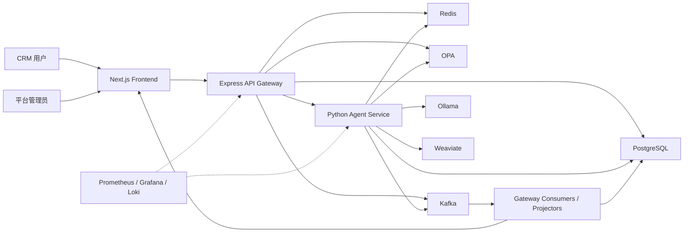
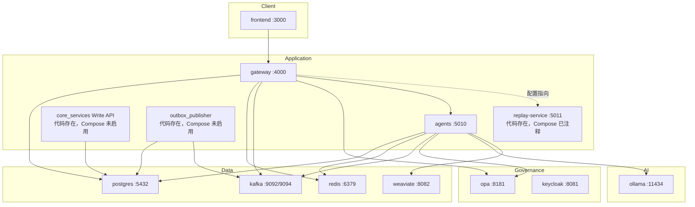
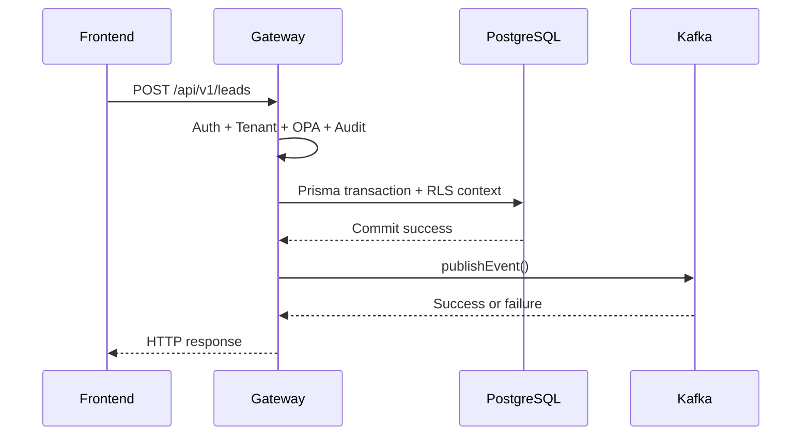
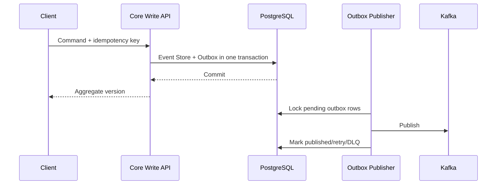
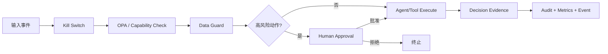

# M-Agent-ECRM 当前项目说明与现状评估

> 评估日期：2026-06-30  
> 评估方式：仓库源码、配置、迁移、测试、部署文件和现有文档的只读扫描  
> 后续优化计划：[`project-optimization-plan.md`](./project-optimization-plan.md)  
> 两轮模型审查协议：[`project-review-protocol.md`](./project-review-protocol.md)

## 1. 项目定位

M-Agent-ECRM 是一个 AI 原生的企业级多租户 CRM 平台，目标是在传统 CRM 能力之上，通过多 Agent 协作完成销售、客服、合规、分析、知识管理和自动化工作。

项目的主要设计特征包括：

- 多租户 CRM 业务模型。
- LangGraph/Ollama 驱动的专业 Agent。
- Kafka 事件驱动架构。
- CQRS、Event Store、Outbox 和事件回放。
- PostgreSQL Row Level Security。
- OPA RBAC/ABAC 策略。
- AI Kill Switch、人工审批、Data Guard 和可解释性。
- GDPR 数据导出、遗忘和保留策略。
- Prometheus、Grafana、Loki 和 OpenTelemetry。
- Docker Compose、Helm 和 GitHub Actions 部署骨架。

当前项目已经超过简单 Demo 的规模，拥有较完整的模块划分和大量实际代码；但设计文档中的部分能力尚未完整接入默认运行链路，因此当前成熟度更接近“功能丰富的工程原型”，而不是已经完成生产认证的平台。

## 2. 仓库结构

本次扫描约发现 589 个文件，主要分布如下：

| 目录 | 主要职责 |
|---|---|
| `frontend/` | Next.js CRM 页面、Agent 控制台、治理和审批界面 |
| `gateway/` | Express API Gateway、认证、OPA、Prisma、Kafka Consumers、WebSocket |
| `agents/` | Python Agent、LangGraph 工作流、治理、Replay 和智能模块 |
| `core_services/` | Event Store、Outbox、缓存、GDPR、容灾和韧性组件 |
| `services/` | 独立 Outbox Publisher |
| `database/` | SQL migration、RLS、事件表、读模型和治理表 |
| `policies/` | OPA/Rego 租户、RBAC、ABAC 和 Agent 策略 |
| `schemas/` | Kafka/CloudEvent JSON Schema |
| `observability/` | Prometheus、Grafana、告警和 SLO |
| `deploy/` | Helm Chart |
| `tests/` | GDPR、缓存、数据治理、DR 和安全测试 |
| `.github/` | CI/CD、Chaos 和租户隔离工作流 |
| `docs/` | 架构说明、Runbook、治理和成熟度文档 |

## 3. 实际技术栈

### Frontend

- Next.js 16.1.6
- React 18
- TypeScript
- Tailwind CSS
- TanStack Query
- Zustand
- React Hook Form/Zod
- Recharts
- WebSocket Client

现有文档部分位置仍称 Next.js 14，与实际依赖不一致。`eslint-config-next` 仍为 14.0.4，也需要和 Next.js 主版本统一。

### Gateway

- Express 4
- TypeScript
- Prisma 5
- PostgreSQL
- KafkaJS
- ioredis
- JWT
- OPA
- `ws`
- Prometheus Client
- OpenTelemetry

### Agents

- Python 3.11+
- LangGraph/LangChain
- Ollama
- aiohttp/FastAPI
- aiokafka
- asyncpg
- Redis
- Weaviate
- Pydantic
- structlog

### Infrastructure

- PostgreSQL 16
- Redis 7
- Kafka KRaft
- OPA
- Keycloak
- Ollama
- Weaviate
- Prometheus/Grafana/Loki
- Docker Compose
- Helm/Kubernetes

## 4. 系统上下文

## 5. 当前容器结构

默认 Compose 中实际启用的是 Frontend、Gateway、Agents 和基础设施。Core Write API、Outbox Publisher、Replay Service 没有进入默认运行拓扑。

## 6. 模块现状

### 6.1 Frontend

已实现页面包括：

- Dashboard
- Leads
- Deals
- Tickets
- Customers
- Agents
- Approvals
- Governance
- Productivity
- Automations
- Knowledge
- Replay

已实现的公共组件包括：

- ChatPanel
- KillSwitch
- ExplainabilityPanel
- AutomationStudio
- AuditSearch
- CustomerTwin
- ReplayControls
- VoiceButton
- LeadFormModal
- ConfirmDialog

现状判断：

- 业务页面覆盖面较广。
- API Client 能自动注入本地 Token。
- 已具备 Loading、列表、Modal 等基础交互。
- 没有发现登录或注册页面。
- Token 直接从 `localStorage.accessToken` 读取。
- TelemetryProvider 仍包含占位逻辑。
- API 类型仍有大量 `any`。
- 权限不足、服务降级、超时和离线等状态没有形成统一 UX。

### 6.2 API Gateway

Gateway 是当前系统的主要运行核心，包含：

- Helmet、CORS、Compression、Rate Limit。
- Correlation ID 和结构化日志。
- JWT Auth。
- Tenant Middleware。
- OPA Middleware。
- Audit Middleware。
- Prisma 数据访问。
- Kafka Producer 和 11 个左右的 Consumers。
- WebSocket Server。
- Metrics、Health 和 Readiness。
- 20 多个业务路由模块。

主要优点：

- 大多数租户业务路由使用 `withTenantDb()`。
- `withTenantDb()` 在 Prisma 事务中执行 `SET LOCAL app.tenant_id`。
- 业务查询通常还显式附加 `tenantId` 条件，形成应用层和数据库层双重保护。
- 路由划分清晰，CRM、治理、自动化、知识和智能模块基本独立。

主要问题：

1. Token 黑名单检查存在异常吞掉问题。
2. 默认 JWT Secret 可被开发配置兜底。
3. Compose 中直接设置 `JWT_SECRET=supersecret`。
4. 主要业务写入仍为“数据库提交后直接发送 Kafka”。
5. Gateway 同时承担边缘服务、领域 CRUD、事件发布、消费者和读模型更新，职责较重。
6. 测试环境存在 OPA 跳过逻辑，需要防止测试通过但生产策略未验证。

### 6.3 Agents

Agent 层包含四类基础领域 Agent：

- Sales Agent
- Support Agent
- Compliance Agent
- Analytics Agent

智能模块还覆盖：

- Chat
- Search
- Automation
- Journey
- Productivity
- Knowledge
- Predictive Analytics
- Compliance Intelligence
- Digital Twins
- DevX
- i18n/Voice

Agent Orchestrator 同时提供：

- Kafka 消费和事件路由。
- `/health`、`/metrics`。
- Intelligence Query。
- Voice Query。
- Automation Parse。
- Audit Search。

主要优点：

- 不是纯接口骨架，存在真实事件路由、LLM 调用和数据库逻辑。
- Kill Switch、Approval、Data Guard、Explainability 和 Telemetry 有独立实现。
- 有较多 pytest、Replay、Chaos 和治理测试。

主要问题：

- Support Agent 等位置仍有 TODO。
- Kafka DLQ 存在未完成路径。
- 一些“集成测试”实际大量依赖 Mock。
- Agent 工具、副作用和治理检查需要进一步证明没有绕过入口。
- Invoice 和 Task Reader 明确返回“未实现”。
- Agent、Replay、Core Service 之间存在部分重复治理和韧性实现。

### 6.4 Core Services

Core Services 已实现：

- CQRS Write API。
- Event Store。
- Optimistic Concurrency。
- Transactional Outbox。
- Secure Cache。
- Circuit Breaker 和 Retry。
- GDPR Erasure/Export。
- PII Registry。
- Retention Policy。
- Backup/Restore。

这部分代码代表项目目标架构中较重要的“可靠写入和治理核心”，但当前没有进入默认 Compose，也不是 Gateway 业务写入的主路径。

因此当前存在两套写入模式：

1. Gateway Prisma CRUD + 直接 Kafka publish。
2. Core Write API + Event Store + Transactional Outbox。

如果长期保留两套主写路径，会导致：

- 数据所有权不明确。
- 事件格式和幂等行为漂移。
- 部分业务可靠、部分业务不可靠。
- Replay 不能保证覆盖全部业务事实。

### 6.5 Database

数据库包含：

- Tenant、User、Role 和 Policy。
- Lead、Deal、Ticket、Customer。
- Agent、Task、Event、Memory 和 Approval。
- Automation、Prediction、Knowledge 和 Productivity。
- Domain Event、Event Stream、Event、Outbox。
- Read Models。
- Agent Decisions。
- GDPR、Retention 和 PII。
- Customer Twin。

已存在：

- Prisma migrations。
- 独立 SQL migrations。
- RLS policies。
- Event Store/Outbox tables。
- Read Model tables。

主要问题：

- Prisma migration 和独立 SQL migration 双轨运行。
- 存在两个 Prisma schema 位置。
- Compose 挂载的 `database/init/` 中没有默认启用的完整初始化 SQL。
- 单纯运行 Compose 无法证明会自动创建完整 schema 和 RLS。
- 需要进一步验证所有租户表都同时应用 `ENABLE/FORCE RLS`、`USING` 和 `WITH CHECK`。

### 6.6 Kafka 与事件流

项目定义了较多业务和智能事件，包括：

- Lead created/updated。
- Ticket created/updated。
- Approval required/decision。
- Agent action proposed/reasoning。
- Productivity signal/action。
- Journey updated。
- Prediction generated。
- Automation simulation/execution。
- Knowledge draft/published。
- Intelligence search/voice。

JSON Schema 已覆盖部分核心事件，并包含 Lead v1/v2 的版本演进示例。

主要问题：

- Gateway 业务路由中仍有大量直接 `publishEvent()`。
- 事务 Outbox 没有覆盖这些主路径。
- Gateway 和 Agent 中均存在 DLQ TODO。
- Schema Registry、Upcaster 和消费者兼容策略尚未形成统一闭环。
- Outbox Publisher 只在启动时读取一次活跃租户列表。

## 7. 当前主要数据流

### 7.1 当前 Gateway 写入流程

该流程在 DB 成功、Kafka 失败时会产生不一致。

### 7.2 已实现但未成为主路径的可靠写入

项目后续需要选择并统一主写模式，不能继续由两套模式长期并存。

## 8. 多租户与安全现状

当前设计采用多层隔离：

1. JWT 中携带 tenant claim。
2. Tenant Middleware 建立请求租户上下文。
3. 路由查询显式使用 `tenantId`。
4. Prisma 事务设置 PostgreSQL `app.tenant_id`。
5. PostgreSQL RLS 自动过滤。
6. OPA 检查 Tenant/RBAC/ABAC。
7. Redis Cache Key 包含 Tenant 和策略上下文。
8. Kafka Event 包含 `tenantid`。
9. Agent Kill Switch 可以按全局、租户或 Agent 控制。

这是项目当前最扎实的架构方向之一，但仍需要补强：

- 修复 Token 撤销绕过。
- 验证 Redis/OPA 故障时的 fail-closed。
- 验证连接池复用不会遗留租户上下文。
- 验证 super admin 跨租户能力。
- 验证 WebSocket、Replay、GDPR、Weaviate 和后台消费者的租户隔离。
- 验证数据库角色不能通过所有者或 `BYPASSRLS` 绕过。

## 9. AI 治理现状

项目已经设计并实现以下治理组件：

- Kill Switch。
- Human Approval。
- Data Guard。
- Explainability。
- Agent Telemetry。
- OPA Agent Policy。
- Audit Event。

目标流程为：

当前需要重点证明：

- 所有工具和副作用入口都经过上述流程。
- 审批后执行前重新检查权限和数据版本。
- Kill Switch 能在消费者重平衡和多副本环境下及时生效。
- Explainability 不泄露隐式推理、系统 Prompt 或敏感数据。
- 模型自由文本不能未经强类型校验直接驱动业务写操作。

## 10. 部署与运行现状

### Docker Compose

配置中包含：

- Frontend
- Gateway
- Agents
- PostgreSQL
- Redis
- Kafka/Kafka UI
- OPA
- Ollama
- Weaviate
- Keycloak
- Prometheus/Grafana/Loki
- Exporters

待完善项：

- Core Write API 未启用。
- Outbox Publisher 未启用。
- Replay Service 被注释。
- Gateway 却配置了 Replay Service URL。
- 数据库完整 migration 和 RLS 需要手工执行。
- Agent 使用固定 `sleep 30` 等待依赖。
- Secret 存在硬编码。

### Helm

目前模板仅包含：

- Gateway
- Agents
- Ingress
- Helpers

存在的问题：

- 缺少 Frontend Deployment/Service。
- Ingress 根路径却指向 Frontend。
- 缺少 Write API、Outbox、Replay、Projectors。
- CI 引用的 staging/production values 不存在。
- Values 声明了 PostgreSQL、Redis、Kafka、OPA、Weaviate、Ollama、Keycloak 和监控，但当前模板没有完整消费这些配置。

### CI/CD

已定义：

- Node lint/build。
- Python Ruff/Mypy。
- Gateway Jest。
- Agent pytest。
- OPA test。
- 镜像构建和推送。
- Staging/Production 部署。
- Tenant Isolation Pipeline。
- Chaos Test Pipeline。

确定性问题：

- Staging/Production values 文件不存在。
- `tests/integration/` 不存在。
- 后续部署和集成测试阶段因此无法按当前配置执行。

## 11. 测试现状

测试覆盖方向较广：

- Gateway API/Auth/Audit/Intelligence。
- RLS enforcement。
- Agent 基础行为。
- Kill Switch 和 Approval。
- Event Store、Replay、Projector。
- Tenant Isolation。
- Automation、Journey、Knowledge、Twins。
- GDPR、Retention、Cache Security。
- Chaos 和 DR。

本次检查结果：

- 134 个 Python 源文件通过 AST 语法解析。
- 24 个 JSON Schema/监控 JSON 文件可以解析。
- 仓库自带 checklist：
  - Security Scan：通过。
  - Lint Check：通过。
  - Schema Validation：通过。
  - Test Runner：通过。
  - UX Audit：失败。
  - SEO Check：失败。

但这些结果不能等同于完整构建通过：

- 当前环境没有 Docker。
- Frontend/Gateway 没有安装 `node_modules`。
- Python 环境缺少 `asyncpg`，pytest 无法完成加载。
- checklist 的部分检查更偏向文件和结构存在性验证。

因此当前只能确认静态完整性，不能确认所有单元、集成、容器和端到端测试真实通过。

## 12. 主要待完善内容

### P0：阻止发布

1. Token 黑名单检查可能放行已撤销 Token。
2. 默认和硬编码 JWT Secret。
3. Gateway 核心写入存在 DB/Kafka 双写。
4. 数据库 migration/RLS 没有统一自动入口。
5. CI 引用不存在的文件和目录。
6. 需要证明所有租户数据路径 fail closed。

### P1：生产前必须完成

1. Core Write、Outbox、Replay 接入运行拓扑。
2. Helm 补齐 Frontend 和其他缺失服务。
3. Kafka Consumer 幂等、DLQ、Replay 和 Schema 兼容闭环。
4. Agent TODO、工具治理和 Prompt Injection 防护。
5. Frontend 登录、权限、错误态和 E2E。
6. 可观测性指标与告警规则真实对应。
7. Compose cold start、Helm install/upgrade/rollback 验证。
8. PostgreSQL/Redis/Kafka/OPA/Ollama 故障恢复验证。

### P2：稳定化和工程质量

1. TypeScript 类型收敛。
2. Next.js/ESLint 版本统一。
3. UX、SEO、可访问性。
4. 文档乱码、技术栈漂移和过度声明修正。
5. 成本、容量、性能和数据归档。
6. 重复治理、韧性和 schema 实现收敛。

## 13. 当前主要故障模式

| 故障 | 当前可能结果 | 目标行为 |
|---|---|---|
| DB 成功、Kafka 失败 | 数据已写入但事件丢失 | Outbox 保留并恢复发布 |
| Redis 黑名单检查异常 | 撤销 Token 可能继续使用 | 明确 fail closed 或安全降级 |
| OPA 不可用 | 部分路径行为需进一步验证 | 敏感操作拒绝并告警 |
| Replay 请求 | 默认目标服务不存在 | Replay 服务健康或功能明确关闭 |
| 空数据库启动 | 完整 schema/RLS 不会自动建立 | 单一 migration runner 完成初始化 |
| Kafka poison message | 可能阻塞或仅记录 TODO | DLQ、告警、修复后 replay |
| 消费者重复处理 | 可能重复副作用 | 数据库幂等约束 |
| Agent 高风险动作 | 需证明无治理绕过 | Kill Switch + OPA + Approval + Audit |
| Helm 部署 | Frontend 目标不存在 | 完整 Chart 可安装和回滚 |
| CI 部署 | 缺失路径导致失败 | 所有必需阶段可重复执行 |

## 14. 扩展路径

### Gateway

- 保持无状态并水平扩容。
- WebSocket 使用共享事件分发或明确的粘性策略。
- 将领域写入和 Projector 职责逐步移出 Gateway。

### Write API 与 PostgreSQL

- 使用聚合版本和乐观并发控制。
- Outbox Publisher 多实例使用 `SKIP LOCKED`。
- 在扩展数据库前先补齐索引、连接池和慢查询指标。
- 读副本只服务允许最终一致的查询。

### Kafka 与 Consumers

- 使用 `tenantId:aggregateId` 等稳定分区键维持聚合顺序。
- Consumer 数量以 partition 和 lag 为依据。
- 高成本 Agent 任务与轻量 Projector 使用不同 consumer group/topic。

### Agents

- 按 Agent 类型、风险级别和模型成本拆分执行池。
- 设置每租户并发和 Token/时间预算。
- 对 LLM、Weaviate、OPA、Gateway 设置超时、熔断和降级。

### Redis 与 Weaviate

- Redis 缓存必须可重建。
- Kill Switch 等安全状态需要复制和恢复策略。
- Weaviate 必须明确 tenant namespace、容量和索引重建流程。

## 15. 综合判断

### 已具备的基础

- 明确的企业 CRM 业务方向。
- 较完整的前后端和 Agent 模块。
- 多租户、OPA、RLS 和 AI 治理意识较强。
- Event Store、Outbox、Replay、GDPR、DR 等高级能力已有代码基础。
- 测试、监控、部署和文档框架基本齐全。

### 当前核心矛盾

项目的问题不是“没有功能”，而是“目标架构与默认运行路径尚未完全统一”：

- 可靠 Write API 已实现，但主业务仍走 Gateway 直接写。
- Outbox 已实现，但没有接入默认拓扑。
- Replay 已实现，但默认服务被关闭。
- Helm 声明了完整平台，但模板只覆盖部分服务。
- 测试数量较多，但当前缺少完整可重复运行证据。
- 文档描述接近目标态，代码实际处于目标态和过渡态并存。

### 当前阶段建议

在继续增加 CRM 或 Agent 新功能前，应优先完成：

1. 认证和租户安全修复。
2. CQRS/Outbox 主写链路统一。
3. Migration、Compose、Helm 和 CI 收敛。
4. 真实依赖集成测试和故障验证。
5. 两轮独立模型审查与发布认证。

具体实施步骤、模块自审查机制和发布门禁见：

- [`project-optimization-plan.md`](./project-optimization-plan.md)
- [`project-review-protocol.md`](./project-review-protocol.md)

