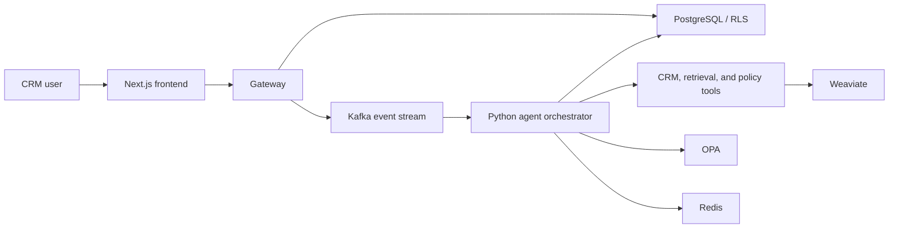
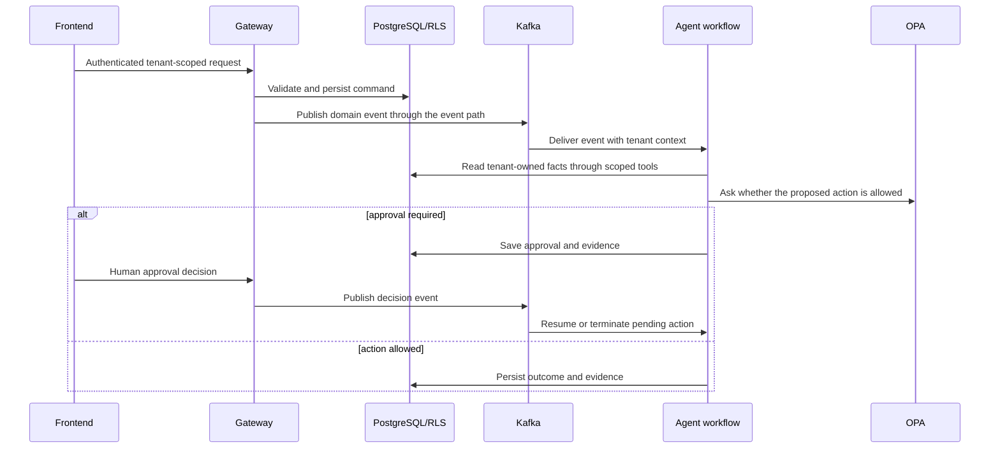

# Architecture Overview for Interviews

## Purpose

This project is a local, production-minded reference implementation for an
AI-assisted CRM. It shows how a business workflow can use agents without
allowing a model to bypass tenant boundaries, policy checks, or human approval.

## Context

## Containers and ownership

| Container/service | Owns | Does not own |
|---|---|---|
| Frontend | Presentation, session-aware UI state, WebSocket UX | Database access, authorization decisions, model calls |
| Gateway | HTTP API, auth, tenant context, request validation, public API contract | Agent orchestration, direct frontend model access |
| Agents | Event-driven workflow execution and tenant-scoped tool use | Browser sessions, public API ownership, policy override |
| PostgreSQL | CRM state, audit records, approvals, RLS enforcement | Event delivery or model inference |
| Kafka | Durable event transport and consumer decoupling | Transactional business writes |
| OPA | Declarative authorization/policy decisions | Data storage or side effects |
| Weaviate | Retrieval index for tenant-scoped knowledge | System-of-record CRM data |
| Redis | Revocation, cache, short-lived workflow/approval coordination | Long-term audit truth |

## Canonical flow

## Safety boundary

The model is not an authority. It can propose structured output, classify
content, retrieve relevant evidence, or select tools within a constrained
workflow. Gateway validation, Pydantic/schema validation, OPA decisions,
approval controls, audit logs, and PostgreSQL RLS independently constrain the
side effects.

The system intentionally stores an explainability summary and evidence
references, not private chain-of-thought, credentials, hidden prompts, or raw
cross-tenant records.

## Failure behavior

| Dependency failure | Expected behavior |
|---|---|
| OPA unavailable or malformed response | Sensitive action fails closed |
| Weaviate unavailable | Workflow records a degraded result; it does not invent retrieved evidence |
| Local LLM unavailable | Default demo remains runnable; opt-in live workflow reports a clear failure/degraded result |
| Redis unavailable | Revocation-sensitive auth follows configured fail-closed policy |
| Kafka transient issue | Consumer/retry/DLQ mechanisms avoid silent loss; events remain observable |
| Approval rejected or expired | Pending side effect is not executed |

## Scaling path

The current target is Docker Desktop, chosen for reproducible local iteration.
If the system needed to move toward production, the first changes would be a
managed secret store, managed database/broker, centralized observability,
provider routing, and a managed container platform. Kubernetes is a possible
future runtime, not a requirement to demonstrate the current architecture.
