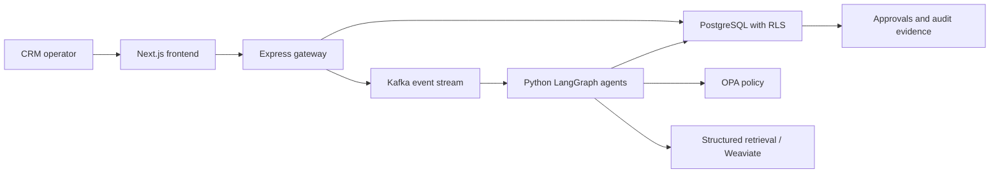

# Multi-Agent Enterprise CRM: Interview Briefing

## Problem

CRM assistance is useful only when it remains grounded in a tenant's own data,
cannot bypass authorization, and leaves a reviewable audit trail. This project
demonstrates those boundaries in a local Docker Desktop deployment target.

## Architecture in one view

The frontend never calls a model or database directly. The gateway owns public
API validation and tenant context; agents propose constrained work; OPA,
approval controls, and PostgreSQL RLS independently constrain side effects.

## What is verified

- Docker Compose health dependencies, idempotent migrations, HTTP smoke tests,
  and WebSocket proxy smoke tests.
- Tenant isolation through PostgreSQL RLS and cross-tenant regression suites.
- Safe agent-run evidence: status, tool outcomes, and bounded evidence IDs are
  visible without raw prompts, chain-of-thought, credentials, or tool payloads.
- Human approval, audit, and kill-switch controls for sensitive actions.
- Supply-chain controls: pinned images, Trivy, SBOM/provenance, CodeQL, and
  digest-oriented deployment wiring.
- An offline AI evaluation artifact containing a real PostgreSQL/RLS structured
  retrieval baseline and deterministic safety contracts.

## Metrics and their boundaries

The H2 offline evidence bundle reports Recall@5, Precision@5, tenant leakage,
prompt-injection block rate, structured-output pass rate, and unsafe execution
count. The retrieval baseline uses synthetic tenant data in real PostgreSQL/RLS;
the safety suite is deterministic and provider-free.

These are not claims about semantic retrieval, end-user answer quality, or live
NVIDIA NIM performance. NVIDIA NIM is an optional runtime provider and must be
shown separately when a user-controlled API key is explicitly configured.

## Failure behavior to explain

| Condition | Expected behavior |
| --- | --- |
| Cross-tenant request | No foreign data returned; RLS remains the final data boundary |
| Prompt injection | Denied before a privileged tool/action is executed |
| OPA unavailable | Sensitive work fails closed |
| Retrieval unavailable | Run records a degraded outcome; it does not invent evidence |
| Approval rejected | Proposed side effect is not emitted |

## Production evolution

The verified target is local Docker Desktop. A production evolution would add a
managed secret store, managed database/broker, centralized observability,
provider routing, and a managed container platform. Kubernetes manifests are
not presented as real-cluster validation.

For detail, use the [architecture overview](architecture.md),
[engineering trade-offs](engineering-tradeoffs.md), and
[current limitations](limitations.md).
