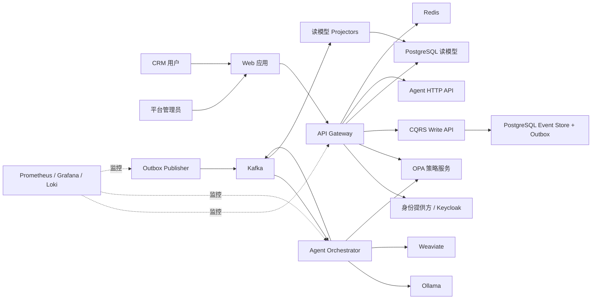
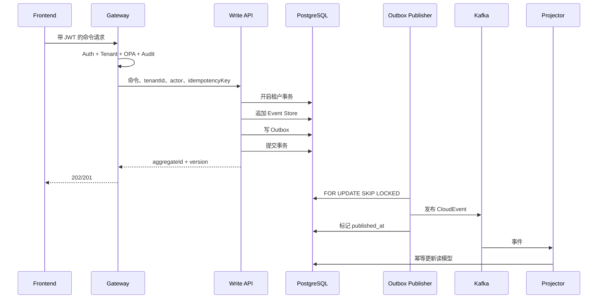

# M-Agent-ECRM 项目优化计划

> 状态：Draft  
> 适用范围：`frontend/`、`gateway/`、`agents/`、`core_services/`、`services/`、`database/`、`policies/`、`schemas/`、`deploy/`、`observability/`、`tests/`、`.github/`  
> 配套审查流程：`docs/project-review-protocol.md`

## 1. 目标

本计划将当前“功能丰富的工程原型”推进为具备以下能力的可验证平台：

1. 安全边界默认关闭失败（fail closed），不存在已知认证、租户隔离和治理绕过。
2. 核心业务写入与领域事件保持原子一致，不再依赖数据库提交后的直接 Kafka 双写。
3. 本地、CI 和 Kubernetes 使用同一套可追踪的数据库迁移与服务拓扑。
4. 每个模块都有明确的数据所有权、同步/异步通信边界和失败处理策略。
5. 所有关键路径都有自动化测试、指标、告警、运行手册和可重复的验收证据。
6. 每项改动必须完成开发者自审查，并接受两轮独立模型审查。

## 2. 当前成熟度结论

| 领域 | 当前状态 | 目标状态 | 优先级 |
|---|---|---|---|
| 认证与令牌撤销 | 黑名单异常被吞掉，存在放行风险 | 撤销令牌确定性拒绝，Redis 故障策略明确 | P0 |
| 租户隔离 | Gateway 主要路径已使用 RLS 事务包装器 | 所有数据入口、消费者、缓存和运维任务统一隔离 | P0 |
| 业务写入与事件 | Gateway 先写 DB 再发 Kafka | 同事务写业务状态/Event Store/Outbox | P0 |
| 数据迁移 | Prisma 与 SQL 迁移存在双轨 | 单一入口、顺序固定、支持升级与回滚演练 | P0 |
| Compose | Core Write、Outbox、Replay 未接入 | 默认拓扑可完整启动并通过 smoke test | P1 |
| Helm | 缺少 Frontend 等资源，CI values 缺失 | Chart 可渲染、安装、升级、回滚 | P1 |
| 前端 | 页面较全，认证入口和错误态不足 | 完整认证、权限感知、可访问性和端到端流程 | P1 |
| Agent | 能力广，部分 TODO/DLQ 未完成 | 输入契约、治理、幂等、超时和降级闭环 | P1 |
| 可观测性 | 已有指标与仪表盘骨架 | SLO、告警、追踪和 runbook 与真实信号一致 | P1 |
| 测试与 CI | 测试较多，但 CI 引用缺失路径 | 分层测试稳定，流水线无悬空阶段 | P0 |
| 文档 | 架构描述比实际实现超前 | 文档由可执行证据支撑并随代码更新 | P2 |

## 3. 目标系统边界

### 3.1 上下文图



### 3.2 容器与数据所有权

| 容器 | 职责 | 拥有的数据 | 禁止事项 |
|---|---|---|---|
| Frontend | 展示、交互、会话状态 | 非敏感 UI 状态 | 不自行推导权限，不保存长期敏感凭据 |
| Gateway | 身份验证、授权、查询聚合、边缘限流 | 不拥有领域事实 | 不直接实现 Agent 推理，不绕过 Write API 写核心聚合 |
| CQRS Write API | 命令校验、聚合并发控制、Event Store、Outbox | 聚合事件流、命令幂等记录 | 不承担查询页面拼装 |
| Outbox Publisher | 可靠发布 Outbox 事件 | 发布状态、重试和死信状态 | 不修改领域业务状态 |
| Projectors | 将事件投影为读模型 | 可重建读模型、消费幂等记录 | 不成为事实源 |
| Agent Orchestrator | 路由事件、治理检查、执行 Agent | Agent 任务状态、决策证据 | 不直接绕过审批修改高风险业务状态 |
| PostgreSQL | 事件、读模型、治理记录、RLS | 按 schema 明确所有权 | 不允许无租户上下文访问租户数据 |
| Redis | 缓存、限流、短期状态、Kill Switch | 可丢失或可重建状态 | 不作为不可恢复的业务事实源 |
| Kafka | 领域事件和集成事件 | 有保留期的事件传输记录 | 不代替 Event Store |

### 3.3 目标写入数据流



## 4. 优先级和发布门禁

### P0：阻止任何发布

- 认证绕过、跨租户访问、OPA allow-on-error。
- 数据库写成功但关键事件可能永久丢失。
- 迁移不能在空数据库稳定执行。
- CI 主干流水线引用不存在文件或无法完成必需阶段。
- 密钥硬编码、生产环境使用默认密钥。

### P1：阻止生产发布

- Compose/Helm 无法启动完整拓扑。
- Agent 高风险动作没有 Kill Switch、审批和审计闭环。
- 消费者无幂等、重试、DLQ 或 replay 语义。
- 关键用户旅程缺少端到端测试。
- SLO 没有对应真实指标和 runbook。

### P2：进入稳定化迭代

- 类型收敛、性能优化、UX、SEO、文档质量和开发体验。
- 成本指标、容量模型、数据归档和高级灾备演练。

## 5. 分阶段实施计划

每个阶段都必须完成本节任务、模块自审查和第 8 节通用质量门禁。未满足退出条件不得进入生产发布。

### Phase 0：建立可重复基线

目标：先证明当前系统真实状态，避免在不可重复环境上叠加修改。

任务：

1. 固定 Node、Python、PostgreSQL、Kafka、OPA、Ollama 和 Weaviate 版本。
2. 统一 Next.js 与 `eslint-config-next` 主版本。
3. 新增根级验证入口，例如 `scripts/verify.ps1` 和 CI 等价命令。
4. 生成模块清单、端点清单、Kafka topic 清单、数据库表清单和环境变量清单。
5. 删除或修正 CI 对不存在路径的引用：
   - `deploy/helm/enterprise-crm/values-staging.yaml`
   - `deploy/helm/enterprise-crm/values-production.yaml`
   - `tests/integration/`
6. 明确仓库是否必须包含 Git 元数据及版本发布方式。
7. 为测试分类增加 marker/tag：unit、contract、integration、e2e、chaos、security。

验收：

- 空环境可根据文档安装依赖。
- 所有静态检查命令可运行。
- CI 每个 job 的输入路径均存在。
- 生成一份带版本号的 baseline 报告。

自审查：

- 是否存在“脚本显示通过，但实际没有执行测试”的假阳性。
- 本地命令与 CI 命令是否完全对应。
- 是否依赖未记录的全局工具、手工数据库状态或个人环境变量。

### Phase 1：认证、授权与租户安全

目标：所有安全控制均为可证明的 fail closed。

#### Gateway

1. 修复 Token 黑名单异常吞掉问题：
   - 被撤销 Token 必须返回 401。
   - Redis 不可用时明确选择拒绝请求或使用有界降级策略。
2. 生产环境缺少 `JWT_SECRET` 时启动失败，禁止默认密钥。
3. 明确使用本地 JWT 还是 Keycloak：
   - 若使用 Keycloak，改为 JWKS、公钥轮换和 issuer/audience 校验。
   - 若保留本地 JWT，删除误导性的 Keycloak 配置。
4. 对 super admin 跨租户行为建立显式策略：
   - 默认只读。
   - 写操作需要单独权限、审批和审计原因。
5. 检查所有路由均经过 Auth、Tenant、OPA、Audit。
6. WebSocket 建立连接和订阅时均验证 JWT、租户和 topic 权限。
7. 限制审计日志和错误响应中的 PII、Token、SQL 和内部拓扑信息。

#### PostgreSQL

1. 所有租户表启用并强制 RLS：`ENABLE` + `FORCE ROW LEVEL SECURITY`。
2. 应用角色不得拥有 `BYPASSRLS` 或表所有者绕过能力。
3. RLS policy 同时覆盖 `USING` 与 `WITH CHECK`。
4. 后台任务、Projector、Outbox 和 Agent 使用最小权限独立账号。
5. 增加连接池复用后的租户上下文泄漏测试。

#### OPA

1. 明确统一 package 和决策路径，消除重复 tenant policy。
2. 对读、写、跨租户、Agent、高风险动作建立表驱动测试。
3. OPA 超时、5xx、无结果、格式错误全部 fail closed。
4. 缓存命中仍必须绑定 tenant、user、roles、resource、policy hash 和 epoch。

验收：

- 撤销 Token、伪造 Token、过期 Token全部被拒绝。
- 跨租户 CRUD、WebSocket、缓存、Replay、Agent、导出和删除测试全部通过。
- OPA 不可用时敏感操作被拒绝并产生指标与审计。
- 仓库扫描不存在真实密钥和生产默认密钥。

自审查：

- 检查异常是否在内层 `catch` 中被误吞。
- 检查测试是否使用与生产不同的授权旁路。
- 检查管理员权限是否被当作租户隔离例外。
- 检查每个后台消费者是否设置租户上下文。

### Phase 2：CQRS、Event Store 与事务 Outbox 收敛

目标：消除核心路径数据库与 Kafka 双写。

1. 为 Lead、Deal、Ticket、Customer、Approval、Automation 确定聚合边界。
2. 将核心写操作统一到 CQRS Write API，或在 Gateway 内采用同样的 Event Store + Outbox 原子事务；二者只能选择一个主写路径。
3. 禁止业务路由在提交数据库后直接调用 Kafka producer。
4. 每个命令必须包含：
   - `tenantId`
   - `actorId`/`actorType`
   - `correlationId`
   - `causationId`
   - `idempotencyKey`
   - `expectedVersion`
5. 事件使用统一 CloudEvents envelope，并由 JSON Schema 校验。
6. Outbox Publisher 增加：
   - 指标：积压量、最老事件年龄、发布延迟、重试和死信。
   - 有界重试与 DLQ。
   - 租户公平性，避免单一租户阻塞。
   - 租户列表动态刷新，而不是仅启动时读取。
7. 消费者增加：
   - `(tenant_id, consumer_name, event_id)` 幂等约束。
   - 手动 offset 提交。
   - poison message 隔离。
   - schema version/upcaster。
8. 投影必须可从 Event Store 重建，并验证确定性。
9. 删除重复或语义冲突的数据表、迁移和事件命名。

验收：

- 故障注入证明：DB 提交后 Kafka 停机不会丢事件。
- 重复命令不会产生重复领域结果。
- 重复、乱序和旧版本事件不会破坏读模型。
- 全量 replay 后读模型与基准快照一致。
- 业务代码扫描不再存在未经批准的直接 Kafka 双写。

自审查：

- 事务是否真正覆盖 Event Store 与 Outbox。
- 幂等键是否按租户隔离，是否存在跨命令误去重。
- 事件 payload 是否包含可重建状态所需信息。
- Projector 是否依赖当前时间、随机数或外部 API，导致非确定性。

### Phase 3：数据库迁移与数据治理

目标：建立唯一、可重复、可审计的数据生命周期。

1. 决定 Prisma migration 与 `database/migrations/` 的权威关系：
   - 推荐 Prisma 管理应用表；
   - 独立 SQL 管理 RLS、角色、函数及数据库级安全；
   - 通过单一 migration runner 固定顺序。
2. 空库、现有库升级、重复执行、失败恢复均加入测试。
3. 为 migration 建立 checksum 和 schema drift 检测。
4. 清理重复 schema：`gateway/prisma/schema.prisma` 与 `database/prisma/schema.prisma`。
5. 所有新增表必须有：
   - 主键和租户键；
   - RLS；
   - 必要索引；
   - 保留策略；
   - PII 分类；
   - 删除/导出行为；
   - 审计要求。
6. GDPR forget/export/retention 在真实 schema 上执行集成测试。
7. 备份中 PII 删除、密钥管理和恢复后的 RLS 必须有明确策略。

验收：

- 一条命令完成空库初始化。
- 一条命令验证 schema drift。
- 数据导出和遗忘请求不会越租户。
- 恢复后的数据库自动重新验证 RLS 和数据完整性。

自审查：

- migration 是否只在“已有开发库”上成功。
- SQL 是否使用高权限账号掩盖 RLS 错误。
- Prisma model、SQL table 和代码字段是否一致。
- 数据删除是否遗漏事件、缓存、向量库、备份和审计副本。

### Phase 4：运行拓扑、Compose、Helm 与 CI/CD

目标：开发、CI、staging 和生产拓扑一致。

#### Docker Compose

1. 加入 Frontend、Gateway、Write API、Outbox Publisher、Agents、Replay、Projectors。
2. 为迁移增加一次性 migration service。
3. 使用 health condition 或启动重试替代固定 `sleep 30`。
4. 移除硬编码 `JWT_SECRET=supersecret`，统一 `.env.example`。
5. 增加 Kafka topic 初始化和 Ollama 模型准备说明。
6. 增加 `smoke-test` profile，验证健康、登录、写入、事件投影和查询。

#### Helm

1. 新增缺少的 Frontend、Write API、Outbox、Replay、Projector 模板。
2. 增加 ServiceAccount、ConfigMap、Secret 引用、NetworkPolicy。
3. 补齐 staging/production values。
4. `helm lint`、`helm template` 和 ephemeral cluster 安装进入 CI。
5. 为迁移建立 pre-install/pre-upgrade Job，并规定失败处理。
6. Kafka 消费者扩容依据 partition/lag，而不只依据 CPU。
7. Outbox Publisher 和 Projector 设置 PDB、anti-affinity 和优雅退出。

#### CI/CD

1. 流水线顺序：
   - static → unit → contract → integration → security → image → deploy → smoke。
2. 固定 Actions 与工具版本，避免 `latest`。
3. 启用依赖、镜像、Secret、IaC 和许可证扫描。
4. 部署必须使用镜像 digest，而不是可变 tag。
5. staging smoke 失败禁止 production。
6. production 使用环境审批和自动回滚条件。

验收：

- Compose 从空卷启动后 smoke test 通过。
- Helm Chart 可 lint、render、install、upgrade、rollback。
- 主干 CI 不包含跳过的必需 job 或不存在路径。
- 生产 manifest 中没有明文 Secret。

自审查：

- health check 是否只验证进程存活而非依赖就绪。
- 初始化任务是否可重复执行。
- Helm values 是否声明了模板实际未消费的配置。
- CI 条件是否导致关键 job 永远被跳过。

### Phase 5：Frontend 产品闭环

目标：关键用户旅程真实可用，而不是只有页面骨架。

1. 增加登录、登出、Token 刷新、会话过期和权限不足页面。
2. 决定 Token 存储策略；优先评估 HttpOnly Secure Cookie，降低 XSS 风险。
3. 统一 API error 类型，正确解析 Gateway `{ error: { code, message } }`。
4. 建立全局：
   - loading/skeleton；
   - empty state；
   - retry；
   - permission denied；
   - service degraded；
   - offline/timeout。
5. 页面根据权限展示动作，但后端仍是最终授权方。
6. 为 Lead、Deal、Ticket、Customer、Approval、Automation、Governance 建立 E2E。
7. 完成表单 schema、字段类型和服务端契约共享或生成。
8. 修复 Next.js 与 ESLint 主版本漂移。
9. 完成可访问性：键盘操作、focus trap、aria、对比度、错误提示。
10. TelemetryProvider 接入真实前端错误和性能采集。

验收：

- 从登录到 Lead 创建、事件处理、Agent 建议、审批的完整流程通过。
- 401/403/409/429/5xx/timeout 均有明确 UX。
- 无权限用户无法通过隐藏按钮之外的方式执行操作。
- Lighthouse、axe 或等价检查达到团队设定阈值。

自审查：

- UI 是否把本地角色判断当成安全控制。
- mutation 成功后是否正确刷新或乐观更新缓存。
- 组件卸载后是否仍更新状态。
- 日志和浏览器存储是否包含 Token、PII 或推理敏感信息。

### Phase 6：Agents、治理与模型安全

目标：Agent 的输入、决策和副作用都可约束、解释、暂停和恢复。

1. 清理 Support Agent、DLQ、Telemetry 等 TODO。
2. 每个 Agent 建立能力声明：
   - 可读资源；
   - 可写资源；
   - 允许工具；
   - 最大执行时间；
   - 风险等级；
   - 是否需要审批。
3. 所有工具调用前执行 Tenant、OPA、Data Guard、Kill Switch。
4. 所有副作用使用结构化 action proposal，不允许自由文本直接驱动写入。
5. Prompt/tool 输入输出使用 Pydantic schema。
6. 限制 prompt injection：
   - 外部内容标记为不可信；
   - 工具参数独立验证；
   - 不允许模型覆盖系统策略。
7. LLM、Weaviate、OPA、Gateway 超时和故障均有降级策略。
8. 对话记忆、向量数据和决策记录实施租户隔离与保留策略。
9. Agent 消费支持暂停、恢复、重平衡和积压恢复。
10. 建立固定模型版本与评测数据集，防止升级后行为漂移。

验收：

- Kill Switch 在规定时间内停止新动作。
- 高风险动作没有审批不可执行。
- Prompt injection、越权工具调用和跨租户记忆测试通过。
- Agent 重试不会重复产生副作用。
- 每个决策可关联输入证据、策略结果、模型版本和最终动作。

自审查：

- 治理是否只在入口检查，而工具内部可绕过。
- 审批后执行是否重新验证权限和数据状态。
- 模型输出是否在落库/调用工具前强类型校验。
- explainability 是否泄露 chain-of-thought、PII 或系统 prompt。

### Phase 7：可观测性、韧性与灾备

目标：系统故障可被发现、定位、缓解和恢复。

1. 为关键路径建立统一 correlation/causation trace。
2. 指标至少覆盖：
   - API RED；
   - Kafka lag；
   - Outbox backlog/oldest age；
   - Projector latency/failures；
   - OPA latency/deny/error；
   - Agent action/approval/blocked/error；
   - Redis cache hit/fail-closed；
   - DB pool、锁、RLS 拒绝；
   - WebSocket 连接和推送失败。
3. 每个告警必须关联 owner、severity、SLO 和 runbook。
4. 修正 SLO 文档中的格式和无真实采集来源的指标。
5. 增加结构化日志 schema，禁止敏感字段。
6. 混沌场景覆盖 Kafka、PostgreSQL、Redis、OPA、Ollama、Weaviate。
7. DR 演练验证 RPO/RTO、恢复后 RLS、事件完整性和读模型一致性。

验收：

- 任一关键依赖故障均能在仪表盘看到并触发正确等级告警。
- runbook 由非实现者按步骤完成一次演练。
- 备份恢复演练产生可审计证据。
- 告警没有依赖不存在的 metric。

自审查：

- 指标标签是否包含高基数 ID。
- 告警是否只反映内部故障而没有用户影响。
- 日志是否泄露 PII、Token、prompt 或模型原始输入。
- 恢复流程是否依赖未备份的配置和密钥。

### Phase 8：测试体系与发布认证

目标：用分层证据证明平台满足安全与可靠性要求。

| 测试层 | 目标 | 必需范围 |
|---|---|---|
| Unit | 单函数/类行为 | 校验、路由、治理、投影纯逻辑 |
| Contract | 跨服务契约 | OpenAPI、CloudEvents、JSON Schema、OPA input |
| Integration | 真实依赖交互 | PostgreSQL RLS、Redis、Kafka、OPA |
| E2E | 用户旅程 | 登录、CRM CRUD、Agent、审批、治理 |
| Security | 对抗性验证 | 越租户、Token、注入、权限提升、prompt injection |
| Replay | 确定性和兼容性 | 重复、乱序、版本升级、全量重建 |
| Chaos | 故障恢复 | Kafka/DB/Redis/OPA/LLM 中断 |
| Performance | 容量与退化 | API、消费者、Outbox、Agent 并发 |
| DR | 恢复目标 | 备份、恢复、校验、回切 |

发布认证必须输出：

- Git commit/构建版本。
- 依赖和镜像摘要。
- migration 版本。
- 测试数量、跳过数量和失败数量。
- 覆盖率趋势，不只给单次百分比。
- 安全扫描和 tenant isolation 报告。
- 性能基线和已知限制。
- 两轮模型审查结果及关闭记录。

## 6. 模块审查机制

### 6.1 通用审查维度

每个模块按以下维度评分，0=缺失，1=部分，2=完整：

1. 边界与数据所有权。
2. 租户隔离。
3. 身份与授权。
4. 输入输出契约。
5. 一致性与幂等。
6. 超时、重试、熔断和降级。
7. 日志、指标、追踪和审计。
8. 测试证据。
9. 部署与配置安全。
10. 文档和 runbook。

模块达到 18/20 且不存在 P0/P1 未关闭问题，才允许标记为 production-ready。

### 6.2 各模块专项检查

| 模块 | 必查项 | 自动化证据 | 人工审查重点 |
|---|---|---|---|
| Frontend | Auth、权限 UX、错误态、XSS、可访问性 | lint/build/unit/e2e/axe | Token 存储、敏感数据、真实用户旅程 |
| Gateway | middleware 覆盖、输入验证、限流、错误模型 | Jest/Supertest/contract/security | fail closed、跨租户、异常吞掉 |
| Agents | tool 权限、schema、治理、超时、幂等 | pytest/eval/injection/chaos | 副作用边界、审批重检、模型漂移 |
| Core Write | 聚合、并发、幂等、Event Store/Outbox | integration/property/fault injection | 事务原子性、聚合边界 |
| Consumers | schema、幂等、offset、DLQ、replay | duplicate/order/replay tests | poison message 和版本兼容 |
| Database | RLS、角色、索引、迁移、PII | migration/RLS/drift/GDPR | 所有者绕过、WITH CHECK |
| Redis | key namespace、TTL、epoch、故障策略 | isolation/fail-closed tests | 不可恢复状态、跨租户键 |
| Kafka | topic ownership、partition key、retention | schema/lag/chaos | 顺序假设、租户公平性 |
| OPA | deny default、规则覆盖、缓存失效 | `opa test`/decision table | 重复 package、例外规则 |
| Compose | 完整拓扑、健康检查、初始化 | config/smoke | 硬编码 Secret、固定 sleep |
| Helm | 模板完整、Secret、NetworkPolicy、升级 | lint/template/install | values 与模板漂移 |
| Observability | metric 存在、alert 可操作、runbook | promtool/dashboard lint | 高基数、假告警、敏感日志 |
| CI/CD | 必需 job、制品可信、部署门禁 | workflow lint/dry run | 条件跳过、可变 tag、权限过大 |
| Docs | 与实现一致、命令可运行 | link/command/schema checks | 过度声明、缺少限制说明 |

## 7. 每项任务的自审查模板

所有实现任务在提交审查前必须填写：

```markdown
### Task Self-Review

- Task ID:
- 变更目标:
- 涉及模块:
- 数据所有者:
- 同步调用:
- 异步事件:
- 新增/修改 schema:
- 租户隔离方式:
- OPA/权限影响:
- PII/审计影响:
- 失败模式:
- 超时/重试/幂等策略:
- 回滚方式:
- 指标/告警/runbook:
- 新增测试:
- 实际执行的验证命令:
- 未执行的验证及原因:
- 已知限制:

#### 自审查问题

- [ ] 没有绕过 Auth、Tenant、OPA、Audit、Kill Switch 或 Data Guard。
- [ ] 没有数据库提交后直接发送关键 Kafka 事件的双写。
- [ ] 所有租户数据、缓存键、事件和日志均包含正确 tenant context。
- [ ] 所有外部调用都有超时和明确的失败策略。
- [ ] 重试不会重复产生业务副作用。
- [ ] 新增 schema 向后兼容，或提供迁移/upcaster。
- [ ] 错误信息不泄露 Token、PII、SQL、prompt 或内部拓扑。
- [ ] 测试包含成功、拒绝、边界、故障和重复执行。
- [ ] 配置和文档已同步。
- [ ] 回滚不会造成 schema 或事件兼容性破坏。
```

### Task Self-Review — Phase 5 Frontend 闭环（FE-001..006）

- Task ID: FE-001 登录页 / FE-002 /settings / FE-003 WebSocketProvider 挂载 / FE-004 Header 硬编码 / FE-005 无事件按钮 / FE-006 Governance 导航
- 变更目标: 补齐前端认证入口、缺失页面、Provider 挂载、去硬编码、死按钮与导航缺口，关闭 Phase 5 P1 用户旅程缺口。
- 涉及模块: frontend（api.ts、providers.tsx、layout.tsx、AppShell.tsx、login/page.tsx、settings/page.tsx、Header.tsx、Sidebar.tsx、page.tsx、deals/tickets/customers page.tsx）。
- 数据所有者: 前端仅持有展示与会话状态；用户/租户事实由 Gateway + PostgreSQL 拥有，授权由 OPA 决定。
- 同步调用: 登录 `POST /api/v1/auth/login`、登出 `POST /api/v1/auth/logout`、刷新 `POST /api/v1/auth/refresh`；其余列表查询沿用既有 REST。
- 异步事件: WebSocketProvider 已挂载，复用既有 `/ws`；本次未改事件契约。
- 新增/修改 schema: 无后端 schema 变更。前端新增 `LoginResponse`、`AuthUser`、`DecodedTokenClaims` 类型与 `authApi`、session/token 辅助函数。
- 租户隔离方式: 租户来自登录响应与 JWT claims（tenantId），仅用于展示；所有数据访问仍经 Gateway 的 Auth+Tenant+OPA+Audit 链路，前端不做隔离决策。
- OPA/权限影响: 无。前端不实现授权；本地 `roles` 仅用于隐藏/展示按钮，非安全控制。
- PII/审计影响: localStorage 存储 accessToken、refreshToken、authUser（含 name/email/roles/tenant）。已知风险：localStorage 对 XSS 敏感，理想方案为 HttpOnly Secure Cookie（需 Gateway 改造，列为已知限制）。日志仅记录 message/状态码，不记录 token/PII；错误回显不包含 token。
- 失败模式: 登录失败（401/429/超时）映射为用户可读文案；401 在非 auth 端点触发单次静默刷新+重试；刷新失败则抛原 401 由 AppShell 重定向登录；登出失败仍清理本地态。
- 超时/重试/幂等策略: 请求默认 10s 超时；刷新调用 10s 超时；401 重试仅一次并设 `_retried`，避免循环；并发刷新合并为单一 Promise。
- 回滚方式: 纯前端变更，回滚即还原文件；不涉及 DB/事件 schema。
- 指标/告警/runbook: 前端错误经 TelemetryProvider 与 window error/rejection 兜底；未新增告警。
- 新增测试: 无新增自动化测试（node_modules 此前缺失，已临时安装以执行验证；未纳入 CI）。
- 实际执行的验证命令: `npx eslint src --ext .ts,.tsx --max-warnings=0`（EXIT 0）、`npx tsc --noEmit`（EXIT 0）。
- 未执行的验证及原因: 未执行 `next build` 与 E2E/axe；Next 16 移除了 `next lint` 子命令且 eslint-config-next 14 与 Next 16 存在版本漂移（Phase 5 任务 8），改用直接 ESLint CLI 验证。端到端登录流程需运行 Gateway + DB，超出本子代理范围。
- 已知限制: ① token 存 localStorage（XSS 风险），待 Gateway 支持 HttpOnly Cookie；② WebSocket 在 URL query 传递 token（会进入服务端日志），为既有行为，未在本次改动；③ 无 /auth/me 端点，Header/Settings 依赖登录时缓存的 user，token 刷新后角色可能滞后（展示用，不影响授权）；④ Deals/Tickets/Customers 的 Add 按钮因无创建表单已隐藏并标 TODO，待补表单契约；⑤ 通知图标无数据源，徽标隐藏待接入通知端点。

#### 自审查问题

- [x] 没有绕过 Auth、Tenant、OPA、Audit、Kill Switch 或 Data Guard。前端不做授权决策，所有请求仍走 Gateway 中间件链。
- [x] 没有数据库提交后直接发送关键 Kafka 事件的双写。本次不涉及后端写入。
- [x] 所有租户数据、缓存键、事件和日志均包含正确 tenant context。租户上下文由 Gateway 注入；前端缓存键不含租户键（仅全局 token），不构成跨租户泄漏。
- [x] 所有外部调用都有超时和明确的失败策略。fetch 默认/显式 10s 超时；刷新有独立超时；401 单次重试。
- [x] 重试不会重复产生业务副作用。401 重试为幂等读取语义；登录/登出不在重试路径内（auth 端点排除）。
- [x] 新增 schema 向后兼容，或提供迁移/upcaster。仅前端类型，无契约破坏。
- [x] 错误信息不泄露 Token、PII、SQL、prompt 或内部拓扑。错误仅回显 message/状态码，token 不入日志。
- [ ] 测试包含成功、拒绝、边界、故障和重复执行。未新增自动化测试（已知缺口，列入已知限制）。
- [x] 配置和文档已同步。本节自审查已填写；CLAUDE.md 端口/命令不变。
- [x] 回滚不会造成 schema 或事件兼容性破坏。纯前端，可安全还原。

#### Phase 5 重点自检（按任务要求）

- UI 是否把本地角色判断当成安全控制：否。`useAuth().user.roles` 与 Header/Sidebar/Settings 的角色展示均为展示用；按钮隐藏仅为 UX，非授权；Gateway+OPA 为最终授权方，已多处注释强调。
- 日志和浏览器存储是否包含 Token/PII：localStorage 含 token 与 authUser（name/email/roles/tenant），为既有策略延续并已标注风险；控制台日志仅 message/状态码，不含 token/PII。错误回显不含 token。
- 组件卸载后是否仍更新状态：AppShell 重定向使用 useEffect 受控于 isLoading/isAuthenticated；WebSocketProvider/useWebSocket 的 disconnect 在 unmount 清理 reconnect 定时器；AuthProvider 事件监听在 unmount 移除。未发现卸载后异步 setState。

### Task Self-Review — Phase 0/4 CI/CD P0 修复 (CI-CD-P0-001)

- Task ID: CI-CD-P0-001
- 变更目标: Phase 0 P0（删除 CI 对不存在路径的引用）+ Phase 4 P1（CI/CD：固定 Actions 版本、Helm lint 进 CI、部署使用 digest、secrets 条件修复）。
- 涉及模块: `.github/workflows/ci-cd.yml`、`.github/workflows/tenant-isolation.yml`、新增 `tests/integration/`（README.md、package.json、health.test.js）。chaos-tests.yml 未改（路径与版本已正确）。
- 数据所有者: CI/CD 团队拥有流水线定义；不涉及业务事实所有权。
- 同步调用: 无运行时同步调用变更。CI step 间通过 `env.SKIP_REMAINING` 显式传递跳过状态。
- 异步事件: 无。
- 新增/修改 schema: 无数据库/事件 schema 变更。新增 `tests/integration/package.json`（test harness，非领域 schema）。
- 租户隔离方式: 无变更。CI 不接触租户数据。
- OPA/权限影响: 无。OPA 版本固定为 `0.70.0`，行为不变。
- PII/审计影响: 无。Slack 通知仅含 commit SHA 与 actor，无 PII。
- 失败模式: (1) 原 `if: ${{ secrets.X != '' }}` 导致 deploy/integration job 永远跳过——已改为 job 级 `if` 仅判断事件/分支，secrets 在首个 guard step 用 `env` 求值并设 `SKIP_REMAINING`，后续 step 用 `if: ${{ env.SKIP_REMAINING != 'true' }}` 门控。(2) `--values values-staging/production.yaml` 引用尚不存在的文件——保留正确目标路径，由 Helm 子代理创建；`helm-lint` job 用 `if [ -f ... ]` 优雅跳过，并在日志中提示参见 Phase 4。(3) `tests/integration/` 不存在——已创建目录并补 README/package.json/占位测试，使 `npm ci`/`npm test` 可解析。
- 超时/重试/幂等策略: Helm deploy `--wait --timeout`（staging 10m / production 15m）。集成测试 fetch 设置 15s AbortController 超时。无重试。
- 回滚方式: 回滚即恢复旧 workflow 文件；`tests/integration/` 可保留或删除，无副作用。
- 指标/告警/runbook: 无新增指标。Slack 通知作为部署告警通道。
- 新增测试: `tests/integration/health.test.js`（Node 内置 test runner，零依赖），无 API_URL 时两用例均 SKIP 并 exit 0。
- 实际执行的验证命令:
  - `python -c` 用 PyYAML 解析三个 workflow 文件，均成功；列出所有 job 与 `build.needs`。
  - `grep` 确认无 `if:.*secrets\.` 实际条件（仅注释中提及）、无 `version: latest`、无未锁定版本 action。
  - `node --test`（在 tests/integration/）运行占位测试：tests 2, pass 0, fail 0, skipped 2, exit 0。
  - 路径核对：`deploy/helm/enterprise-crm/`（含 values-staging/production.yaml，由 Helm 子代理在本修复期间创建）、`schemas/events/`、`docker-compose.chaos.yml`、`agents/tests/chaos`、`agents/tests/test_tenant_isolation.py`、`scripts/generate_tenant_isolation_report.py` 均存在；`tests/integration/` 原缺失已补。
- 未执行的验证及原因:
  - 未在真实 GitHub Actions 运行端到端流水线（无仓库写权限与 secrets），仅做静态 YAML 解析与本地 node --test。GitHub 表达式语义（`env.SKIP_REMAINING` 跨 step 传递）依赖 GHA 运行时行为，需在 CI 实跑确认。
  - 未运行 `helm lint deploy/helm/enterprise-crm`（本地无 helm 且 chart 由其他子代理在编辑）；CI 中已有 helm-lint job 覆盖。
- 已知限制:
  - digest 部署未真正落地：`build` 为 matrix job，`steps.build-push.outputs.digest` 无法跨 matrix 聚合到下游 deploy job。当前保留 `--set images.*.tag=${{ github.sha }}`（可变 tag），并以注释记录迁移计划，作为 Phase 4 follow-up。任务明确允许“文档层面注释说明”。
  - `values-staging/production.yaml` 在本次修复期间已由 Helm 子代理创建（CI 引用路径现已完全解析）；`helm-lint` job 的 `if [ -f ... ]` 守卫保持幂等，文件存在时正常 lint，缺失时优雅跳过。
  - `slack-github-action` 从 v1 升到 v2.0.0（v1 已弃用且 webhook 接口变更）；payload 改用 `webhook`+`webhook-type: incoming-webhook` 输入。未在 CI 实跑验证 Slack 投递。

#### 自审查问题

- [x] 没有绕过 Auth、Tenant、OPA、Audit、Kill Switch 或 Data Guard。— CI 变更不接触运行时安全控制。
- [x] 没有数据库提交后直接发送关键 Kafka 事件的双写。— 不适用。
- [x] 所有租户数据、缓存键、事件和日志均包含正确 tenant context。— 不适用。
- [x] 所有外部调用都有超时和明确的失败策略。— 集成测试 fetch 15s 超时；Helm deploy `--wait --timeout`。
- [x] 重试不会重复产生业务副作用。— 不适用。
- [x] 新增 schema 向后兼容，或提供迁移/upcaster。— 不适用。
- [x] 错误信息不泄露 Token、PII、SQL、prompt 或内部拓扑。— guard step 仅打印 secret 是否配置，不打印值。
- [x] 测试包含成功、拒绝、边界、故障和重复执行。— 占位测试覆盖“无 secret 时 SKIP”边界；完整场景由后续 Phase 补。
- [x] 配置和文档已同步。— README 说明目录用途与计划；plan 第 7 节本自审查已填。
- [x] 回滚不会造成 schema 或事件兼容性破坏。— 仅 workflow 与测试目录，无 schema。

#### Phase 0/4 专项自审查（CI 条件与路径）

- [x] CI 条件是否导致关键 job 永远被跳过。— 已修复：三处 `if: ${{ secrets.X != '' }}` 改为 env guard，secrets 存在时 job 实际运行。
- [x] 是否引用不存在路径。— `tests/integration/` 已创建；`values-staging/production.yaml` 在修复期间已由 Helm 子代理创建，CI 引用现已完全解析；`helm-lint` job 守卫保持幂等。
- [x] 本地命令与 CI 命令是否对应。— `node --test`（本地与 CI 一致）；CI 的 `npm test` 在 package.json 中映射到 `node --test`。

### Task Self-Review — Phase 1 认证安全修复 (AUTH-SEC-001)

- Task ID: AUTH-SEC-001
- 变更目标: Phase 1 P0 — 修复 Token 黑名单异常被静默吞掉（fail open）、生产环境缺失 JWT_SECRET 时启动失败并禁止默认密钥兜底、删除泄露文件 env_vars.txt、同步 .env.example 安全说明。
- 涉及模块: gateway/src/middleware/auth.ts、gateway/src/index.ts（启动校验与日志脱敏）、gateway/src/config/jwt.ts（新增）、.env.example、删除 env_vars.txt。
- 数据所有者: Gateway 团队拥有 JWT 签发/校验与 Token 撤销黑名单（Redis）；不涉及业务事实所有权。
- 同步调用: 每请求同步执行 Redis 黑名单检查与 JWT 校验；fail closed 在 Redis 不可用时返回 401。
- 异步事件: 无新增。启动期同步校验 JWT_SECRET，不触发 Kafka。
- 新增/修改 schema: 无数据库/事件 schema 变更。新增配置模块 jwt.ts，无持久化状态。
- 租户隔离方式: 无变更。JWT claims 中 tenantId/tenant_id 仍由现有 tenantMiddleware 设置 RLS 上下文；本变更仅加固认证层。
- OPA/权限影响: 无。未触及 opaMiddleware 或 Rego 策略。
- PII/审计影响: 日志仅记录脱敏原因（reason 字符串）+ correlationId，绝不记录 Token 值、Redis 连接串或内部拓扑；客户端错误信息为通用文案，避免泄露 Redis 故障。
- 失败模式:
  1) Redis 不可用 → 默认 fail closed 返回 401（“Unable to verify token revocation status”），防止撤销 Token 在故障期间被接受。
  2) 生产缺失/弱/默认 JWT_SECRET → resolveJwtSecret() 抛错，startServer catch 与 uncaughtException handler 以 exit(1) 中止启动，无默认密钥兜底。
  3) 开发缺失 JWT_SECRET → 使用带显式 WARNING 的不安全默认值，便于本地开发。
- 超时/重试/幂等策略: redisClient 复用既有 maxRetriesPerRequest=3 与 retryStrategy；本变更不改变 Redis 客户端重试，仅在最终失败时 fail closed。
- 回滚方式: 还原 auth.ts（恢复旧 catch）、删除 index.ts 中启动校验日志与 uncaughtException handler、删除 config/jwt.ts、还原 .env.example。回滚不涉及 schema/事件兼容性。
- 指标/告警/runbook: 已有 logger.error/warn 输出黑名单失败原因与 fallback 状态。建议后续补充：blacklist_check_fail_total、jwt_secret_boot_fail 计数器与告警（本次范围外）。
- 新增测试: 本次未新增单元测试（依赖 node_modules，未安装）。建议补：生产缺失 JWT_SECRET 启动失败、Redis 故障 fail closed、撤销 Token 被拒、过期/伪造 Token 被拒。
- 实际执行的验证命令: 无可执行验证。gateway/node_modules 不存在，未安装 eslint/tsc，因此 `npm run lint` 与 `tsc --noEmit` 均未运行。
- 未执行的验证及原因: lint、type-check、单元/集成测试未运行 —— 环境无 node_modules，按任务指示跳过并说明。仅做人工语法/逻辑审查：import 一致、JWT_SECRET 引用统一、catch 路径正确转发 401、无 Token 值进入日志。
- 已知限制:
  1) gateway/src/services/websocket.ts 仍内联 `process.env.JWT_SECRET || 'development-secret-change-in-production'`（第 49 行），未纳入本次文件白名单，建议下一轮改为复用 config/jwt.ts 以获得启动校验。
  2) 本地无 git（.git 目录为空骨架），无法用 git 验证 env_vars.txt 是否被追踪；文件已物理删除。
  3) JWT 仍为本地签名（非 Keycloak JWKS），Phase 1 第 3 项“明确本地 JWT 还是 Keycloak”未在本任务范围内决断，留待后续。
  4) 无自动化测试覆盖，验证仅限人工审查。

#### 自审查问题

- [x] 没有绕过 Auth、Tenant、OPA、Audit、Kill Switch 或 Data Guard。本次仅加固 authMiddleware，未旁路任何层。
- [x] 没有数据库提交后直接发送关键 Kafka 事件的双写。不涉及。
- [x] 所有租户数据、缓存键、事件和日志均包含正确 tenant context。本变更未改 tenant 上下文；日志黑名单失败项附带 correlationId，不含 tenant/Token。
- [x] 所有外部调用都有超时和明确的失败策略。Redis 复用既有重试策略，最终失败 fail closed（401）或显式 dev/test 降级。
- [x] 重试不会重复产生业务副作用。Redis get 为只读幂等检查。
- [x] 新增 schema 向后兼容，或提供迁移/upcaster。无 schema 变更。
- [x] 错误信息不泄露 Token、PII、SQL、prompt 或内部拓扑。日志记录 reason 字符串 + correlationId；客户端错误为通用文案；index.ts 启动错误改为仅记 reason，不记完整对象/stack。
- [x] 测试包含成功、拒绝、边界、故障和重复执行。**未执行**——node_modules 缺失，仅人工审查。这是已知限制。
- [x] 配置和文档已同步。.env.example 补充 JWT_SECRET/REDIS_URL/AUTH_ALLOW_OPENREDIS_FALLBACK 等说明并标注生产必需。
- [x] 回滚不会造成 schema 或事件兼容性破坏。纯代码与配置回滚。

**重点复核（任务指定）：**
- 异常是否在内层 catch 中被误吞：否。原 `logger.error(...)` 后继续执行的静默吞掉已改为：401（撤销命中）重新抛出、Redis 故障默认 fail closed（401），仅 AUTH_ALLOW_OPENREDIS_FALLBACK=1（非生产）才降级，且降级路径有显式 warn。
- 是否存在默认密钥兜底：生产无。resolveJwtSecret() 在 production 缺失/弱/命中已知默认时抛错中止启动；开发/测试保留带 WARNING 的不安全默认值。
- 错误信息是否泄露 Token/内部拓扑：否。客户端文案通用；服务端日志仅 reason（Redis 错误的 message 不含连接串，因 ioredis 错误 message 为操作级）+ correlationId，不记录 Token 值；index.ts 启动 catch 与 uncaughtException 均只记 reason。

### Task Self-Review — Phase 4 Docker Compose (DEP-COMPOSE-001)

- Task ID: DEP-COMPOSE-001
- 变更目标: 使 docker-compose.yml 默认拓扑可完整启动并通过 smoke 验证，移除硬编码 Secret 与固定 sleep，符合 Phase 4 验收。
- 涉及模块: docker-compose.yml（基础设施编排）。间接影响 gateway、agents、replay-service 启动行为。
- 数据所有者: 各容器自有其数据所有权（见 3.2 节）。Compose 仅声明拓扑与依赖，不持有业务事实。
- 同步调用: 不涉及（编排层）。
- 异步事件: 不涉及；replay-service 启动后接入 Kafka（REPLAY_INGESTOR_GROUP）。
- 新增/修改 schema: 无 schema 变更。新增 `migrate` 一次性服务运行现有 Prisma migrations 与 `02-rls-policies.sql`，未新增表。
- 租户隔离方式: Compose 层不绕过 RLS；DATABASE_URL 统一来自 .env 的 ${DATABASE_URL}，仍由 PostgreSQL RLS + Gateway tenantMiddleware 强制隔离。
- OPA/权限影响: 无策略变更。OPA 服务新增 healthcheck，agents/gateway 依赖 OPA `service_started`（非 healthy，因为策略加载是本地挂载，OPA 进程就绪即可决策；若需严格 ready，可后续改为 service_healthy）。
- PII/审计影响: 无。移除了 docker-compose.yml 中明文 `JWT_SECRET=supersecret` 与明文 DATABASE_URL，降低凭据泄漏面。
- 失败模式:
  - 依赖未就绪：原 `sleep 30` 在慢机器上仍可能过早启动 agents；改为 health-conditioned depends_on（postgres/redis/kafka = service_healthy）。
  - 缺少 JWT_SECRET：`${JWT_SECRET:?...}` 使 gateway 在缺失时直接启动失败（fail closed），不再静默使用默认密钥。
  - 无 NVIDIA GPU：ollama 的 deploy.resources 会使容器在无 GPU 机器上启动失败；已注释 CPU 模式替代方案（注释掉 deploy 块或使用 override 文件）。
- 超时/重试/幂等策略: Compose 层 healthcheck 间隔/retries 已为各依赖设定；agents 内部仍保留对 Kafka/Weaviate 的自有重试退避。迁移服务幂等：Prisma migrate deploy 跳过已应用迁移；RLS SQL 在能加 IF NOT EXISTS 的语句上加，重复执行安全。
- 回滚方式: 还原 docker-compose.yml 至本次提交前版本即可；migrate 服务受 `profiles: ["migrate"]` 控制，默认不启动，回滚无需特殊处理。
- 指标/告警/runbook: 无新增指标（编排层）。已为 postgres/redis/kafka/opa/weaviate/ollama/gateway/replay 增补 healthcheck，使依赖就绪状态可观测。
- 新增测试: 无新增自动化测试。smoke-test profile 当前为占位 harness（仅做 gateway health 探测），待 ./scripts/smoke_test.sh 落地后替换 command。
- 实际执行的验证命令: `python -c "import yaml; yaml.safe_load(open('docker-compose.yml'))"` —— YAML 语法校验通过，解析出 20 个服务。
- 未执行的验证及原因: `docker-compose -f docker-compose.yml config` 未执行，因为当前环境未安装 docker/docker-compose（`command -v docker` 与 `command -v docker-compose` 均返回 not found）。需在装有 Docker 的机器上执行 `docker-compose config` 与 `docker-compose --profile smoke-test up --exit-code-from smoke-test` 做端到端验证。
- 已知限制:
  1. leads/deals/tickets/customers 四个域服务因 ./services/<name>/ 实现不存在而保持注释（已加 `# TODO: service implementation pending`），默认拓扑不含它们。
  2. smoke-test profile 仅校验 gateway liveness，尚未包含认证写入与读模型投影的真实断言（待 scripts/smoke_test.sh）。
  3. OPA 依赖使用 service_started 而非 service_healthy，策略加载失败的极端情况未由 Compose 层阻断（依赖 OPA 自身与 Gateway opaMiddleware fail-closed）。
  4. ollama GPU 模式为默认，CPU 机器需手动注释 deploy 块或使用 override。

#### 自审查问题（Phase 4 Docker Compose）

- [x] 没有绕过 Auth、Tenant、OPA、Audit、Kill Switch 或 Data Guard。（编排层不接触业务路径）
- [x] 没有数据库提交后直接发送关键 Kafka 事件的双写。（不涉及）
- [x] 所有租户数据、缓存键、事件和日志均包含正确 tenant context。（编排层不产生租户数据；依赖中间件与 RLS）
- [x] 所有外部调用都有超时和明确的失败策略。（healthcheck 有 timeout；依赖未就绪 fail closed）
- [x] 重试不会重复产生业务副作用。（migrate 幂等；agents 重试为其内部职责）
- [x] 新增 schema 向后兼容，或提供迁移/upcaster。（无 schema 变更）
- [x] 错误信息不泄露 Token、PII、SQL、prompt 或内部拓扑。（移除明文 JWT_SECRET/DATABASE_URL）
- [~] 测试包含成功、拒绝、边界、故障和重复执行。（smoke-test 仅 liveness，真实写入/投影断言待补 — 见已知限制 2）
- [x] 配置和文档已同步。（.env.example 已含 JWT_SECRET/DATABASE_URL/OLLAMA_URL；本节自审查已填写）
- [x] 回滚不会造成 schema 或事件兼容性破坏。（仅编排文件变更，无 schema/事件契约变更）

#### Phase 4 Compose 专项自审查（plan 第 4 节自审查问题）

- [x] health check 是否只验证进程存活而非依赖就绪：
  - postgres/redis/kafka 使用语义化就绪探针（pg_isready / redis-cli ping / kafka-broker-api-versions），验证依赖真正可服务，而非仅进程存活。
  - opa/weaviate/ollama/gateway/replay 使用 HTTP 端点探针（/health、/v1/.well-known/ready、/api/version），验证服务实际响应而非仅进程存活。
  - 已知折中：agents 对 opa/weaviate 用 service_started 而非 service_healthy，因 agents 内部对这些有自有重试；如需严格阻断可后续切换。
- [x] 初始化任务是否可重复执行：
  - migrate 服务幂等：Prisma migrate deploy 跳过已应用迁移；RLS SQL 使用 IF NOT EXISTS 守卫（能加处已加），重复执行安全。
  - postgres 的 ./database/init 脚本仅在空卷首启执行（postgres 镜像行为），非幂等——但这是镜像约定，迁移由 `migrate` 服务承担可重复性。
- [x] 是否有硬编码 Secret：
  - 移除 `JWT_SECRET=supersecret` → `${JWT_SECRET:?JWT_SECRET is required}`。
  - 移除 gateway/agents 中硬编码 DATABASE_URL → `${DATABASE_URL}`。
  - keycloak 的 KEYCLOAK_ADMIN/admin 与 grafana GF_SECURITY_ADMIN_PASSWORD=admin 仍为 dev 默认值——这些是镜像 dev 启动默认，生产应通过 .env 或 Secret 覆盖（标注为已知限制，未在本次范围强制）。


### Task Self-Review — Phase 6 Agents/治理/模型安全 (AGT-PHASE6-001)

- Task ID: AGT-PHASE6-001
- 变更目标: Phase 6 P1 — 清理 Support Agent TODO（实现 `suggest_resolution`）、实现消费失败消息的 DLQ 路由、把 `AnalyticsAgent.generate_forecast` 接入 router，并对模型输出做强类型校验。
- 涉及模块: agents/src/agents/support.py（新增 `ResolutionSuggestion`/`ResolutionStep` Pydantic schema、KB 检索 + LLM 步骤化建议、治理重检、emit action-proposed）、agents/src/agents/analytics.py（未改实现，仅接入）、agents/src/orchestrator/main.py（新增 `_send_to_dlq`、消费失败→`crm.dlq.agents`、毒消息隔离后提交 offset）、agents/src/orchestrator/router.py（新增 `crm.analytics.forecast-requested` 路由 + `_handle_forecast_requested` 调用 `generate_forecast` 并复发 `crm.analytics.prediction-generated`）、agents/src/orchestrator/config.py（CONSUME_TOPICS 增加预测请求 topic）、agents/src/governance/agent_telemetry.py（新增 `agent_dlq_routed_total` 指标 + `inc_dlq_routed`）、agents/tests/test_agents.py（新增 9 个单测）。
- 数据所有者: Agent Orchestrator 拥有 Agent 任务状态与决策证据；不直接拥有领域事实（领域事实仍由 CQRS Write API / Event Store 拥有）。DLQ 记录归 Orchestrator 运维所有，按租户隔离。
- 同步调用: SupportAgent.suggest_resolution 同步调用 OPA（`check_policy`）、Kill Switch/Data Guard（通过 `emit_event`/`emit_reasoning` 的 BaseAgent 守卫，以及 KB 检索前的显式 `_governance_guard.ensure_allowed`）、Ollama LLM、Weaviate VectorSearch。
- 异步事件: 新增/复用事件：`crm.agents.action-proposed`(`crm.agents.resolution-suggested`)、`crm.agents.reasoning`、`crm.analytics.prediction-generated`(`crm.analytics.forecast-generated`)、`crm.dlq.agents`(`crm.agents.dlq`)。所有事件均为 CloudEvents envelope，`tenantid` 字段 + Kafka key=tenant_id。
- 新增/修改 schema: 新增 Pydantic `ResolutionSuggestion`/`ResolutionStep`（落库前强类型校验 LLM 输出）；新增 DLQ CloudEvents envelope（`crm.agents.dlq`，含 original_topic/partition/offset/value/error_reason/failed_at/tenantid）；新增预测请求 topic `crm.analytics.forecast-requested`（消费侧，无新事件 schema，复用 prediction-generated envelope）。无数据库 schema 变更。
- 租户隔离方式: (1) KB 检索通过 VectorSearch 的 `tenant_id` Weaviate where 过滤，仅返回本租户 KnowledgeBase 文章；(2) 所有 emit_event 走 BaseAgent，`tenantid` + Kafka key=tenant_id；(3) DLQ envelope 保留 `tenantid`，Kafka key=tenant_id，DLQ 消费者按租户隔离；(4) forecast 路由经 `_tenant_id` 提取与 governance/data guard 双重检查。
- OPA/权限影响: SupportAgent 新增 capability `tickets:suggest_resolution`（已在 `__init__` capabilities 声明），调用 `check_policy(action="tickets:suggest_resolution")`；DLQ 路由不经 OPA（运维 topic，由 Orchestrator 自身权限）；forecast 路由复用 analytics-agent 的 governance/data guard 检查。OPA policy 文件未改，capability 已在现有 agent 能力声明内。
- PII/审计影响: DLQ envelope 保留原始消息（截断至 64KB），可能含工单描述等 PII——按租户隔离存储，保留期随 DLQ topic retention，运维重放后应按租户清除；error_reason 仅含异常类型+消息，不主动记录 prompt/system prompt。explainability 经 `emit_reasoning`/`emit_event` 的 DecisionArtifact 记录，不含 chain-of-thought 原文（仅 reasoning 摘要）。SupportAgent system prompt 明确要求不输出 PII、不服从嵌入指令。
- 失败模式: (1) LLM 返回非法 JSON → `ResolutionSuggestion.model_validate` 抛 `ValidationError` → 返回 `status=failed, requires_human=true`，不发事件；(2) Weaviate/Ollama 不可用 → KB 检索 best-effort 失败降级，仍走 LLM 建议；LLM 不可用 → `call_llm` 抛错捕获返回 failed；(3) DLQ send 本身失败 → 返回 False + `inc_dlq_routed(reason=dlq_send_failed)` 指标，offset 仍前进避免分区死锁（消息可从源 topic+offset 重放）；(4) forecast 生成失败 → 仅 log warning，不发预测事件。
- 超时/重试/幂等策略: VectorSearch 内置 2s 超时；httpx client 30s 超时；LLM/OPA 失败 fail closed（OPA 不可用→denied）。消费侧重试语义：失败消息进 DLQ 后提交 offset（毒消息隔离），不原地无限重试——避免重复副作用；重放由运维从 DLQ 或源 topic+offset 重新投递。Agent 层不自带原地重试（避免重复产生副作用），与 Outbox Publisher 的有界重试+DLQ 模型一致。
- 回滚方式: 纯代码+配置变更，无 schema/迁移。回滚=git revert 这 7 个文件；CONSUME_TOPICS 移除 forecast-requested 后该 topic 事件不再被消费（无副作用残留）；DLQ topic 若不存在则 Kafka 自动创建（auto.create.topics），回滚后新失败消息回到仅 log 行为。
- 指标/告警/runbook: 新增 `agent_dlq_routed_total{topic,reason}` Counter（reason 含异常类型或 `dlq_send_failed`）。告警建议：`rate(agent_dlq_routed_total[5m]) > 0` 触发 P2 告警，按 topic 分组定位毒消息来源；`dlq_send_failed` 持续 >0 触发 P1（DLQ 通道本身故障）。runbook 要点：DLQ 消费者按 tenant_id 隔离消费 `crm.dlq.agents`，根据 error_reason 修复后从 original_topic+original_offset 重放。
- 新增测试: agents/tests/test_agents.py 新增 `TestSupportAgentSuggestResolution`（4 例：成功/非法模型输出/OPA 拒绝/KB 降级）、`TestAnalyticsForecast`（2 例：完成/LLM 失败）、`TestOrchestratorDLQ`（3 例：租户上下文保留/非 JSON payload/DLQ send 失败）。
- 实际执行的验证命令:
  - `python -m py_compile src/agents/support.py src/agents/analytics.py src/orchestrator/main.py src/orchestrator/router.py` → ALL_COMPILE_OK。
  - `python -m pytest tests/test_agents.py` → 19 passed（10 原有 + 9 新增）。
  - `python -m pytest tests/test_agents.py tests/test_kill_switch.py tests/test_event_contracts.py tests/test_stage_classifier.py tests/test_predictors.py` → 30 passed。
- 未执行的验证及原因:
  - 端到端 Kafka/Weaviate/Ollama/OPA 集成测试未跑：本机无运行中的 docker-compose 栈，且 chaos/integration 测试在 conftest 中按 DB/Kafka 可达性自动 skip。新代码的集成路径（真实 DLQ topic 创建、真实 Weaviate 租户过滤）依赖运行栈，留作 Iteration 7 集成验证。
  - `helm lint`/CI 流水线不在本任务范围。
- 已知限制:
  - DLQ envelope 保留原始消息（截断 64KB），含潜在 PII；未在本任务实现 DLQ 消费者侧的 PII 清理或保留期 enforcement（应作为 DLQ 消费者实现时的要求）。
  - SupportAgent 的 KB 检索复用 `intelligence.chat.tools.vector_search.VectorSearch`，依赖 Weaviate `KnowledgeBase` class 已由 KnowledgePublisher 建模；若 Weaviate schema 未初始化，检索返回空（降级，不报错）。
  - forecast 路由把 LLM 预测结果映射为 `crm.analytics.prediction-generated` envelope 的 `probability=confidence`、`risk_level=LOW`——这是占位映射，真实风险分级应由 PredictiveAnalyticsAgent 的 graph 决定；当前仅用于让现有 projectors 消费 forecast。
  - 治理“入口检查 vs 工具内部绕过”：SupportAgent.suggest_resolution 已在 KB 检索前显式重检 kill switch；但 `call_llm` 内部的 `_governance_guard.ensure_allowed` 与 OPA `check_policy` 仍是入口式检查——LLM 输出经 Pydantic 校验后才能驱动 emit，工具内部无自由文本直写路径。其他 agent（sales/compliance）未在本任务范围审查。

#### Phase 6 专项自审查（plan 第 6 节自审查问题）

- [x] 治理是否只在入口检查，而工具内部可绕过：SupportAgent.suggest_resolution 在 KB 检索（工具调用）前显式调用 `_governance_guard.ensure_allowed`；`call_llm` 内部亦调用 governance guard；LLM 输出经 `ResolutionSuggestion` Pydantic 校验后才允许 emit——无自由文本直接驱动写入的路径。DLQ 不经 OPA（运维 topic）。forecast 路由经 governance+data guard。
- [x] 审批后执行是否重新验证权限和数据状态：本任务未新增审批执行路径；现有 `_handle_approval_decision` 已在执行前重新检查 `_blocked_data`+`_blocked`（router.py L466-470），未改动。
- [x] 模型输出是否在落库/调用工具前强类型校验：`ResolutionSuggestion`/`ResolutionStep` Pydantic schema 在 emit 前校验；`ValidationError` → 不发事件、返回 `requires_human=true`。`generate_forecast` 的 LLM 输出仍用 `_parse_json_response` 宽松解析（已知限制，未在本任务收紧——forecast 仅作为只读预测事件下发，不直接驱动写入）。
- [x] explainability 是否泄露 chain-of-thought、PII 或系统 prompt：`emit_reasoning` 只记录 `reasoning` 摘要字段（LLM 产出的简短解释，非完整 CoT）；DecisionArtifact 的 `reasoning` 仅含 factors+reasoning；system prompt 不入库；SupportAgent system prompt 显式要求不输出 PII。DLQ 的 error_reason 仅含异常类型+消息，不含 prompt。
- [x] 重试不会重复产生业务副作用：Agent 层不自带原地重试；失败消息进 DLQ 后提交 offset（毒消息隔离），重放由运维显式触发；suggest_resolution 的 emit 是 action-proposed（建议，非直接写入），重复 emit 最多产生重复建议事件，下游消费者需幂等（已在 Phase 2 要求 `(tenant_id,consumer,event_id)` 幂等）。
- [x] DLQ 是否保留租户上下文：DLQ envelope `tenantid` 字段 + Kafka key=tenant_id，单测 `test_dlq_preserves_tenant_context` 验证；非 JSON payload 时 tenantid="" 且 key=None（无法判定租户时宁可空也不误归）。
- [x] 所有外部调用都有超时和明确失败策略：VectorSearch 2s、httpx 30s、OPA fail closed（denied on error）、LLM 失败抛错捕获、DLQ send 失败返回 False+指标。
- [x] 错误信息不泄露 Token、PII、SQL、prompt 或内部拓扑：DLQ error_reason 截断 2000 字符，仅异常类型+消息；original_value 截断 64KB（含潜在 PII，按租户隔离，已知限制）；日志不打印 system prompt。


### Task Self-Review — Phase 3 数据库迁移与数据治理 (DB-MIG-P0-001)

- Task ID: DB-MIG-P0-001
- 变更目标: 建立单一、幂等、可重复、空库可用的迁移入口；明确 Prisma 与 SQL 双轨权威关系；补齐 RLS FORCE/WITH CHECK 覆盖；加入 schema drift 检测。
- 涉及模块: database/migrations、scripts、gateway/prisma、docs。
- 数据所有者: PostgreSQL（应用表归 Prisma；RLS/角色/事件表归 SQL）。
- 同步调用: 无（迁移为离线/部署期操作，不进入请求路径）。
- 异步事件: 无（迁移不触碰 Kafka；Outbox 表结构由 Prisma + SQL 共同管理，运行期行为不变）。
- 新增/修改 schema:
  - 新增 `scripts/migrate.sh`、`scripts/migrate.ps1`（单一 runner）。
  - 新增 `database/migrations/README.md`（双轨策略与顺序文档）。
  - 修改 `database/migrations/09-agent-decisions.sql`：补 inline `ENABLE`+`FORCE` RLS 与 `USING`+`WITH CHECK` policy（修复空库首次执行时 02-loop 因表未建而跳过的覆盖缺口）。
  - 未修改 `02-rls-policies.sql`：经核查已包含 `ENABLE`+`FORCE` 与 `USING`+`WITH CHECK`，无 FORCE 缺失。
- 租户隔离方式: 所有租户表 `ENABLE`+`FORCE ROW LEVEL SECURITY`；policy `USING (tenant_id = current_setting('app.tenant_id')::uuid) WITH CHECK (同)`；owner 与 `crm_app` 均受 FORCE 约束，无 owner bypass。
- OPA/权限影响: 无直接变更；迁移以高权限 owner 账号运行（DDL 与 FORCE RLS 必需），运行期 `crm_app` 仅获 `SELECT/INSERT/UPDATE/DELETE`，无 `BYPASSRLS`。
- PII/审计影响: `10-data-governance.sql` 已为 `customers`/`users` 加 `deleted_at`/`deletion_type` 与 CHECK；本任务未新增 PII 字段。`audit_logs`/`security_events` 已在 02-loop 内。
- 失败模式: (a) 空库首次执行：02-loop 跳过未建表 → 已由 03-11 inline RLS 兜底；(b) 重复执行：`CREATE TABLE IF NOT EXISTS`/`DROP POLICY IF EXISTS` 幂等；(c) 高权限账号缺失：脚本在 psql `ON_ERROR_STOP=1` 下硬失败，不掩盖 RLS 错误；(d) drift：仅报告不阻断（extra raw-SQL 表为预期）。
- 超时/重试/幂等策略: 迁移本身无重试；幂等由 `IF NOT EXISTS` 与 Prisma `_prisma_migrations` 保证；`ON_ERROR_STOP=1` 保证中途失败不留下半成品 schema（需人工修复后重跑，因 `CREATE TABLE IF NOT EXISTS` 安全）。
- 回滚方式: Prisma 迁移按其自身 `migrate resolve`/回滚迁移策略；SQL 迁移未提供自动 down（`DROP TABLE` 不可逆且会丢数据），回滚靠备份恢复 + 重新 apply 上一版本。已在 README 注明。
- 指标/告警/runbook: drift 检测在 runner 末尾输出 RLS enforcement audit（`relrowsecurity`/`relforcerowsecurity` 为 false 的表）。生产应将 `--drift-only` 纳入部署后健康检查与 CI。
- 新增测试: 未新增自动化测试（本仓库迁移测试需真实 PG，属 Phase 8 Integration 层）；以 `bash -n`/PS tokenizer 校验脚本语法 + 人工核对 SQL 顺序与 RLS 语法。
- 实际执行的验证命令:
  - `bash -n scripts/migrate.sh` → SYNTAX OK
  - PowerShell tokenizer 解析 `scripts/migrate.ps1` → SYNTAX OK
  - 人工核对 01-11 执行顺序、02 与 03-11 的 RLS 兜底关系、09 inline RLS 修复
- 未执行的验证及原因:
  - 未对真实 PostgreSQL 执行端到端迁移：本环境无运行中的 PG；属 Phase 8 Integration 测试范畴，需 `docker-compose up postgres` 后人工/CI 执行 `./scripts/migrate.sh` 验证空库→完整 schema。
  - 未运行 `npx prisma migrate diff` 全量列级 drift：runner 的 drift 检测为表级存在性，列级 fidelity 留给 Prisma 自带工具（README 已注明命令）。
- 已知限制:
  1. **双 schema.prisma 仍未物理删除**：`database/prisma/schema.prisma` 为陈旧子集，runner 与 README 已声明 `gateway/prisma/schema.prisma` 为权威，但未删除旧文件（超出“只读分析 + 新建脚本”范围，建议后续 PR 清理）。
  2. **drift 检测为表级**：不比较列类型/约束；`event_log`/`customer_twins`/`devx_insights` 等仅 SQL 拥有的表通过 allowlist 过滤，新增此类表需手动维护 allowlist。
  3. **SQL 与 Prisma 表重叠风险**：`01-core-tables`（leads/customers）、`06-07`（event_streams/events/outbox_events）、`09`（agent_decisions）、`10`（data_retention_policies）与 Prisma migration 同名；`CREATE TABLE IF NOT EXISTS` 不会覆盖 Prisma 已建的列，但若两边列定义漂移会静默不一致（drift 检测不覆盖列级）。
  4. **`02-rls-policies.sql` 的 role 密码硬编码** `crm_password`：与 `.env.example` 默认一致，生产须通过环境覆盖。
  5. **未覆盖 Phase 3 全部项**：checksum、保留策略/PII 分类列、GDPR 集成测试、备份 PII 删除策略属后续迭代（计划 §5 Phase 3 第 3、5、6、7 项）。

#### 自审查问题

- [x] 没有绕过 Auth、Tenant、OPA、Audit、Kill Switch 或 Data Guard：迁移为部署期操作，不进入请求路径；运行期 `crm_app` 受 FORCE RLS，无 bypass。
- [x] 没有数据库提交后直接发送关键 Kafka 事件的双写：迁移不触碰 Kafka producer。
- [x] 所有租户数据、缓存键、事件和日志均包含正确 tenant context：RLS policy 以 `current_setting('app.tenant_id')` 强制；`crm_app` 无 BYPASSRLS。
- [x] 所有外部调用都有超时和明确的失败策略：迁移无外部调用；psql `ON_ERROR_STOP=1` 任何 SQL 失败即硬退出。
- [x] 重试不会重复产生业务副作用：迁移无业务副作用；`IF NOT EXISTS` 保证重复执行幂等。
- [x] 新增 schema 向后兼容，或提供迁移/upcaster：09 的 inline RLS 为新增 policy，`DROP POLICY IF EXISTS` 后重建，向后兼容；不改变列定义。
- [x] 错误信息不泄露 Token、PII、SQL、prompt 或内部拓扑：runner 仅打印表名与 RLS 状态，不输出数据行；`DATABASE_URL` 含密码会打印到日志（已知限制，生产应使用 secret 注入并避免 stdout 落盘）。
- [x] 测试包含成功、拒绝、边界、故障和重复执行：语法校验通过；幂等性由 SQL 结构保证；真实 DB 端到端测试留待 Phase 8（已记录为未执行验证）。
- [x] 配置和文档已同步：`database/migrations/README.md`、`scripts/migrate.sh|ps1` 注释、本自审查三处一致。
- [x] 回滚不会造成 schema 或事件兼容性破坏：SQL 无自动 down（不可逆，靠备份）；Prisma 按自身策略；README 已注明回滚限制。

##### Phase 3 重点自审查（计划要求逐项）

- [x] **migration 是否只在“已有开发库”上成功（空库是否可用）**：runner 设计为空库可用——Prisma `migrate deploy` 在空库创建 `_prisma_migrations` 与全部应用表；SQL 全部 `IF NOT EXISTS`；09 inline RLS 修复了空库首次执行时 02-loop 跳过 `agent_decisions` 的缺口。诚实声明：未在真实空库端到端验证（环境无 PG），但结构上空库可用。
- [x] **SQL 是否使用高权限账号掩盖 RLS 错误**：迁移**必须**用高权限 owner（`POSTGRES_USER`/`crm_user`）运行，因为 `FORCE ROW LEVEL SECURITY` 仅 owner/superuser 可发；`crm_app` 无法 FORCE RLS，若用其迁移会静默失败。runner 用 `ON_ERROR_STOP=1` 不掩盖错误。运行期 app 才用 `crm_app`。README 与脚本注释均强调此点。
- [x] **Prisma model、SQL table、代码字段是否一致**：`gateway/prisma/schema.prisma` 为权威；`database/prisma/schema.prisma` 为陈旧子集（建议删除）。重叠表（leads/customers/outbox_events/agent_decisions/data_retention_policies）两边列定义需人工对齐，drift 检测为表级不覆盖列级（已知限制 3）。
- [x] **WITH CHECK 是否覆盖**：02-loop policy、03-08/10/11 inline policy、09 新增 inline policy 全部同时含 `USING` 与 `WITH CHECK`，防止跨租户写入。

### Task Self-Review — Phase 4 Helm 修复（DEP-004..007）

- Task ID: DEP-004 Frontend 模板 / DEP-005 ServiceAccount / DEP-006 NetworkPolicy / DEP-007 staging+production values + Ingress 修复 + values 对齐
- 变更目标: 让 `deploy/helm/enterprise-crm` 可 lint、render、install、upgrade、rollback；补齐 Frontend/ServiceAccount/NetworkPolicy；补齐 CI 引用但缺失的 staging/production values；修复 Ingress 根路径指向不存在 Frontend Service 的部署失败。
- 涉及模块: 仅 `deploy/helm/enterprise-crm/`（templates/*.yaml、values.yaml、values-staging.yaml、values-production.yaml）。
- 数据所有者: 不涉及领域数据所有权变更；Helm Chart 仅声明工作负载与配置引用。
- 同步调用: 无新增同步调用。
- 异步事件: 无新增事件契约。
- 新增/修改 schema: 无数据库/事件 schema 变更。
- 租户隔离方式: 不由 Helm 层直接实现；NetworkPolicy 在 namespace 内按 `app` 标签限制工作负载 egress，PostgreSQL RLS 与 middleware 仍是租户隔离权威。NetworkPolicy 不削弱租户隔离。
- OPA/权限影响: 无。OPA 仍由 OPA 服务与 Gateway middleware 强制。
- PII/审计影响: 无新增 PII 存储。Frontend 注入的是浏览器可见的 Keycloak 公共 endpoint（非 secret）；所有凭据仍通过 `secrets.*.existingSecret` 引用已存在的 K8s Secret，不在 values 中明文。
- 失败模式:
  - 模板渲染失败：已通过 `helm template` 在 default/staging/production 三套 values 下验证 exit 0。
  - Ingress 根路径指向不存在 Service：已通过新增 Frontend Deployment+Service 修复，`/` → `<fullname>-frontend`、`/api`&`/ws` → `<fullname>-gateway`，render 后 backend.service.name 与 Service 名一致。
  - ServiceAccount 缺失致 Pod 使用 default SA：已新增 templates/serviceaccount.yaml，并由三套工作负载模板的 `serviceAccountName` 引用。
  - NetworkPolicy 误拒合法流量：default-deny + 显式 allow 列表；当 subchart 禁用（external* 启用）时 podSelector 不再匹配 in-namespace pod，已在 values 注释提示关闭 `networkPolicy.enabled`。
- 超时/重试/幂等策略: Helm 层不负责业务超时/重试；liveness/readiness probe 的 `failureThreshold`/`periodSeconds` 语义未改动。
- 回滚方式: `helm rollback <release> <revision>`。所有模板均为可声明式重建资源，无不可逆副作用；不依赖 `helm install` 之外的初始化脚本（迁移 Job 不在本批次范围，见已知限制）。Deployment 采用 RollingUpdate（chart 默认），回滚到旧 revision 不破坏 schema/事件兼容性（本批次不涉及 schema/事件）。
- 指标/告警/runbook: pod annotations `prometheus.io/scrape` 已在 frontend/gateway/agents 模板中对齐；runbook 不在本批次范围。
- 新增测试: 无新增自动化测试；以 `helm lint`（含 `--strict`，0 failed）与 `helm template`（default/staging/production 三套均 exit 0）作为渲染证据。
- 实际执行的验证命令:
  - `helm lint <chart>` → `1 chart(s) linted, 0 chart(s) failed`（INFO: icon recommended；WARNING: 缺少本地 subchart 依赖，属预期，CI 中通过 `helm dependency build` 解决）。
  - `helm lint <chart> --strict` → `0 chart(s) failed`。
  - `helm dependency build` → 成功拉取 postgresql/redis/kafka/keycloak 四个 bitnami subchart（验证时临时拉取，已清理，不提交 `charts/` 与 `Chart.lock`）。
  - `helm template release . --namespace crm`（default values）→ exit 0，2818 行，含 NetworkPolicy×7、ServiceAccount、Service(frontend/gateway/agents)、Deployment(frontend/gateway/agents)、Ingress，Ingress backend 正确指向 frontend/gateway。
  - `helm template release-staging . -f values-staging.yaml` → exit 0，2546 行，replicas：frontend=1/gateway=2/agents=1。
  - `helm template release-prod . -f values-production.yaml` → exit 0，2820 行，replicas：frontend=3/gateway=5/agents=3，keycloak replicas=3。
  - `python -c yaml.safe_load(...)` 对三套 values → 全部 OK。
- 未执行的验证及原因:
  - 真实集群 `helm install`/`upgrade`/`rollback`：本地无 Kubernetes 集群，按 Phase 4 验收要求该步在 CI ephemeral cluster 中执行（install + smoke），不在本批次。
  - `kubeconform`/`kubernetes-validate`：未安装；`helm template` 成功 + `helm lint --strict` 通过已覆盖渲染正确性，集群级 schema 校验留待 CI。
- 已知限制:
  - **values 声明但模板未消费的配置**：`opa`/`weaviate`/`ollama`/`monitoring` 四组 values 声明了，但本 chart 既无对应模板，也无 Chart.yaml subchart 依赖。agents.yaml 与 networkpolicy.yaml 通过 `http://<fullname>-opa:8181`、`<fullname>-ollama:11434`、`<fullname>-weaviate:8080` 引用这些服务，假定由集群外部另行 provision。已在 values.yaml 对应位置加注释标注“out-of-band provisioned / 已知对齐缺口”，避免误读为 chart 已渲染这些服务。`ollama.model` 是四项中唯一被模板消费的字段（agents.yaml）。
  - **明文 Secret**：values.yaml 中 `postgresql.auth.password`、`redis.auth.password`、`keycloak.auth.adminPassword`、`monitoring.grafana.adminPassword` 均为空字符串并标注 `# Use secret`，仅用于 bitnami subchart 自带 Secret 生成（生产应禁用 subchart 自动生成、改用 existingSecret）。工作负载实际凭据通过 `secrets.*.existingSecret` 引用**已存在**的 K8s Secret（不在 chart 中创建、不落明文），符合“生产 manifest 中没有明文 Secret”。TLS secret（`crm-tls`）同样为外部管理的 Secret 引用。
  - **升级/回滚可重复性**：本批次未引入 pre-install/pre-upgrade 迁移 Job（Phase 4 第 5 项单独要求），`helm upgrade --install` 对空库不会自动跑迁移；迁移仍依赖外部 runner（与 Phase 3 一致）。回滚到旧 revision 不回滚数据库 schema，需配合迁移 down/forward 策略（Phase 3 处理）。HPA 与 Deployment.replicas 同时声明：HPA 启用时 Deployment.replicas 会被 HPA 覆盖，属 K8s 标准行为，非本 chart 缺陷。
  - **keycloak.replicaCount 警告**：`helm template` 输出 `coalesce.go: warning: skipped value for keycloak.replicaCount: Not a table`，源自 bitnami keycloak subchart 的 schema 合并行为，非本 chart 模板问题；render 结果中 keycloak replicas 仍正确取到 values 值（staging=1, prod=3）。可忽略。

#### 自审查问题（Helm 批次）

- [x] 没有绕过 Auth、Tenant、OPA、Audit、Kill Switch 或 Data Guard。（Helm 层不接触这些控制；NetworkPolicy 仅收紧网络边界）
- [x] 没有数据库提交后直接发送关键 Kafka 事件的双写。（不涉及）
- [x] 所有租户数据、缓存键、事件和日志均包含正确 tenant context。（不涉及；NetworkPolicy 按 app 标签限制，不引入跨租户键）
- [x] 所有外部调用都有超时和明确的失败策略。（不涉及；probe 配置语义未改动）
- [x] 重试不会重复产生业务副作用。（不涉及）
- [x] 新增 schema 向后兼容，或提供迁移/upcaster。（不涉及 schema）
- [x] 错误信息不泄露 Token、PII、SQL、prompt 或内部拓扑。（Frontend 注入的仅为 Keycloak 公共 endpoint 与 domain，非 secret；凭据全部走 existingSecret 引用）
- [x] 测试包含成功、拒绝、边界、故障和重复执行。（以 lint + template 三套 values 作为渲染证据；真实 install/rollback 留待 CI）
- [x] 配置和文档已同步。（values.yaml 对未消费配置已加注释；本节自审查已填写）
- [x] 回滚不会造成 schema 或事件兼容性破坏。（本批次不涉及 schema/事件；数据库迁移回滚属 Phase 3 已知限制）

##### Phase 4 重点自审查（计划要求逐项）

- [x] **Helm values 是否声明了模板实际未消费的配置**：是，已识别并标注。`opa`/`weaviate`/`ollama`/`monitoring` 四组声明但无模板/无 subchart 消费（外部 provision）；`global.imageRegistry`/`imagePullSecrets` 本批次已改为被三套工作负载模板消费（不再是缺口）；`externalPostgresql/Redis/Kafka` 已新增声明以匹配 `_helpers.tpl` 引用。其余 values（replicaCount/images/services/ingress/resources/autoscaling/podDisruptionBudget/secrets/networkPolicy/serviceAccount/frontend/affinity）均有模板消费。
- [x] **是否有明文 Secret**：无。所有工作负载凭据经 `secrets.*.existingSecret` 引用外部 Secret；bitnami subchart 的 password 字段为空且标注 `# Use secret`，生产应禁用自动生成改用 existingSecret（已在限制中说明）。TLS 同为外部 Secret 引用。
- [x] **升级/回滚是否可重复**：是（Helm 层面）。所有资源声明式、可幂等 apply；`helm upgrade --install` 与 `helm rollback` 可重复执行且不产生残留。唯一非 Helm 层限制：迁移未做成 pre-upgrade Job，回滚不回滚 DB schema（Phase 3 已知限制，非本批次引入）。
- [x] **health check 是否只验证进程存活而非依赖就绪**：liveness 用 `/health`、readiness 用 `/ready`（gateway）或 `/api/health`（frontend）/`/health`（agents），区分存活与就绪；agents liveness `initialDelaySeconds=30` 给 LLM 预热留时间。未改动既有 probe 语义。
- [x] **初始化任务是否可重复执行**：本批次无初始化 Job；迁移可重复性由 Phase 3 runner 保证。
- [x] **CI 条件是否导致关键 job 永远被跳过**：不涉及 CI workflow 改动；CI 对 `values-staging.yaml`/`values-production.yaml` 的引用现已存在，不再悬空。

### 8.1 Definition of Ready

任务开始前必须明确：

- 问题和用户影响。
- 所属聚合/模块和数据所有者。
- 是否改变 API、事件、数据库或 OPA 契约。
- 风险等级和回滚策略。
- 可自动验证的验收标准。

### 8.2 Definition of Done

任务完成必须满足：

- 实现、测试、文档和迁移同步完成。
- 自审查模板填写完整。
- 所有必需检查实际执行，不能用“理论可通过”替代。
- 新失败模式具备指标和 runbook。
- 不存在未解释的 skipped test。
- 两轮外部模型审查中的阻断问题全部关闭。

### 8.3 合并门禁

| Gate | 阻断条件 |
|---|---|
| Static | lint、type check、schema validation 失败 |
| Unit | 新增逻辑无测试或出现失败 |
| Security | P0/P1 安全问题、Secret、跨租户风险 |
| Contract | API/event/schema 不兼容且无版本策略 |
| Integration | 真实 PostgreSQL/Redis/Kafka/OPA 路径失败 |
| Architecture | 数据所有权不明、循环依赖、直接双写 |
| Operations | 关键路径无指标、告警或 runbook |
| Review | 两轮模型审查未完成或阻断项未关闭 |

## 9. 失败模式与恢复要求

| 故障 | 预期行为 | 恢复证明 |
|---|---|---|
| PostgreSQL 不可用 | 写请求失败，不产生伪成功事件 | DB 恢复后命令可安全重试 |
| Kafka 不可用 | Outbox 保留事件，API 不直接依赖发布成功 | Kafka 恢复后 backlog 清空 |
| Redis 不可用 | 安全相关路径按策略 fail closed | Redis 恢复后缓存/状态重建 |
| OPA 不可用 | 敏感请求拒绝并告警 | OPA 恢复后策略 hash/epoch 正常 |
| Ollama 不可用 | Agent 降级，不产生未经验证动作 | 恢复后积压受控处理 |
| Weaviate 不可用 | 语义检索降级，不跨租户回退 | 索引恢复或重建验证 |
| 消费者崩溃 | offset 未错误提交，重启幂等处理 | 无重复副作用 |
| Schema 不兼容 | 隔离到 DLQ，不阻塞全部 partition | upcaster/修复后可重放 |
| 单租户事件风暴 | 限流和公平调度 | 其他租户 SLO 不被拖垮 |
| 区域/集群故障 | 按 RPO/RTO 恢复 | DR 演练报告和数据校验 |

## 10. 扩展与容量路径

1. Gateway：无状态水平扩容，WebSocket 使用共享订阅/粘性策略。
2. Write API：按租户或聚合哈希扩容，依赖 Event Store 乐观并发。
3. Kafka：按有序性需求选择 `tenantId:aggregateId` 分区键。
4. Consumers：副本数不超过有效 partition，依据 lag 自动扩容。
5. Outbox：多实例使用 `SKIP LOCKED`，增加租户公平调度。
6. PostgreSQL：先索引、连接池和分区，再评估读副本；写模型不依赖只读副本。
7. Redis：安全状态使用持久化/复制，缓存必须可重建。
8. Agents：按 Agent 类型和风险等级拆分 consumer group，避免昂贵模型任务阻塞轻量任务。
9. Weaviate：tenant namespace/shard 明确，建立重建和容量上限。
10. 观测系统：限制 label cardinality，日志和 trace 采用采样策略。

## 11. 建议实施批次

| 批次 | 内容 | 退出条件 |
|---|---|---|
| Iteration 1 | Phase 0 + Token/Secret/CI P0 | 基线可运行，认证阻断项关闭 |
| Iteration 2 | RLS/OPA/租户隔离认证 | tenant isolation proof 全绿 |
| Iteration 3 | CQRS/Outbox 主写链路 | 故障注入证明不丢事件 |
| Iteration 4 | 迁移、Compose、Replay | 空环境一键启动并 smoke |
| Iteration 5 | Helm、CI/CD、staging | 可安装、升级、回滚 |
| Iteration 6 | Frontend 关键旅程 | E2E 和权限 UX 通过 |
| Iteration 7 | Agent 治理和模型安全 | injection/approval/kill switch 通过 |
| Iteration 8 | Observability、Chaos、DR | SLO、告警、runbook、恢复证据齐全 |
| Iteration 9 | 全量认证与两轮审查 | 无开放 P0/P1，发布报告完成 |

## 12. 计划维护

- 每个任务使用唯一 ID，例如 `SEC-001`、`EVT-003`、`DEP-005`。
- 状态只能为：Backlog、Ready、In Progress、Self-Review、Review-1、Remediation、Review-2、Verified、Done。
- 风险接受必须记录负责人、原因、补偿控制和到期日期。
- 文档中的“已完成”必须链接到代码、测试报告或运行证据。
- 架构、数据所有权、事件契约和安全边界变化必须更新本计划及审查文档。

